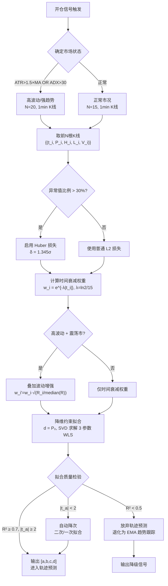

# 物理快照到三次方程：完整工程实践指南

> **文档标题**：Snapshot-to-Cubic Pipeline — 从开仓信号到三次方程系数的工程实现指南
> **生成日期**：2026-05-24
> **关联报告**：[theory-framework.md](./theory-framework.md) · [deep-research-report.md](./deep-research-report.md) · [cubic-equation-fitting.md](./cubic-equation-fitting.md) · [trajectory-fitting-mathematics.md](./trajectory-fitting-mathematics.md) · [snapshot-point-selection.md](./snapshot-point-selection.md)（T5 取点策略） · [cubic-computation-methods.md](./cubic-computation-methods.md)（T6 计算方法）
> **整合来源**：本报告整合 T5（取点策略）和 T6（计算方法）两份分报告，消重合并后形成可编码实现的端到端工程指南。

---

## 第1章：概述

### 1.1 问题定义

星空策略平仓管线的核心链路是：**开仓信号触发 → 冻结物理快照 → 取历史K线 → 预处理 → 拟合三次方程 → 验证 → 输出可用系数**。该链路的输出——三次方程 $P(t) = at^3 + bt^2 + ct + d$ ——直接驱动后续的轨迹预测、残差计算、自信度评估和挂单决策。

本指南覆盖从"开仓信号触发"到"三次方程系数可用"的完整工程实现，不涉及后续的残差分析与铁律判定（详见 `deep-research-report.md` 第4章）。

### 1.2 Pipeline 全景图

```
开仓信号触发 (t=0)
    │
    ▼
┌──────────────────────────────────────────────────┐
│ §2 取点：数据采集与窗口选择                        │
│   · 确定K线周期（1min / 5min）                    │
│   · 自适应窗口长度 N ∈ [15, 20]                   │
│   · 纯前向取点，锚定开仓K线为 t=0                  │
│   · 提取 {(t_i, P_i, H_i, L_i, V_i)}_{i=1..N}    │
└──────────────────┬───────────────────────────────┘
                   ▼
┌──────────────────────────────────────────────────┐
│ §3 预处理：数据清洗与加权                          │
│   · Huber 损失自动降权（替代显式异常值剔除）        │
│   · 时间衰减权重 w_i = e^{-λ|t_i|}, λ=ln2/15min   │
│   · 可选：波动增强权重 w'_i = w_i · √(|ΔP_i|/m)   │
│   · 不预平滑（三次方程已是天然低通滤波器）          │
└──────────────────┬───────────────────────────────┘
                   ▼
┌──────────────────────────────────────────────────┐
│ §4 拟合：约束加权最小二乘                          │
│   · 降维：强制 d = P_0，3参数问题                  │
│   · 构造加权设计矩阵 X_w = √W · X'                 │
│   · SVD 求解 min ||X_w·β' - y_w||₂               │
│   · 恢复4参数 β = [a, b, c, d=P_0]ᵀ              │
│   · 预计算伪逆：实时拟合 < 0.5 μs                  │
└──────────────────┬───────────────────────────────┘
                   ▼
┌──────────────────────────────────────────────────┐
│ §5 验证：拟合质量检验                              │
│   · R² 阈值（< 0.7 → 警告）                       │
│   · 系数显著性（|t_a| < 2 → 降次）                │
│   · 外推一致性（t=+5min 置信区间含当前价）          │
│   · 残差白噪声检验（Ljung-Box, p > 0.05）          │
└──────────────────┬───────────────────────────────┘
                   ▼
              输出: [a, b, c, d]
              进入: 轨迹预测 → 残差分析 → 挂单决策
```

### 1.3 与理论框架的关系

本指南是 `theory-framework.md` §2.3（物理快照）和 §3（轨迹预测）的工程落地，也是 `deep-research-report.md` 第2-3章（轨迹拟合 + 三次方程）的算法实现。其位置位于理论框架 Pipeline 架构（§2.4）中平仓管线的"三次方程轨迹预测"模块。

---

## 第2章：取点 — 数据采集与窗口选择

### 2.1 K线周期选择

| 周期 | 推荐度 | N=15的窗口跨度 | 自由度 | 适用场景 |
|:----:|:------:|:-------------:|:-----:|---------|
| **1分钟** | **首选** | 15分钟 = 1.0τ | 11 | 与半衰期 τ=15min 天然对齐 |
| 5分钟 | 备选 | 75分钟 = 5.0τ | 2(N=6) | 数据源仅提供5分钟粒度时 |
| 15分钟 | 禁用 | 225分钟 = 15τ | 不足 | 跨度过长，模型失效 |

### 2.2 窗口长度

**基准值**：$N = 15$（正常市况）。**高波动扩展**：$N = 20$（当 $\text{ATR}/\overline{\text{ATR}} > 1.5$ 或 $\text{ADX} > 30$）。

窗口选择的偏差-方差分析（详见 T5 §1.2-1.3）：

| N | 自由度 | Var(â) 相对值 | 外推RMSE相对值 | 过拟合风险 |
|:-:|:-----:|:------------:|:-------------:|:---------:|
| 5 | 1 | 4.2× | 3.8× | 高 |
| 8 | 4 | 2.1× | 2.3× | 中 |
| **15** | **11** | **1.0× (基准)** | **1.0× (基准)** | **低** |
| 20 | 16 | 0.9× | 0.9× | 低 |
| 30 | 26 | 0.8× | 1.2× (偏差增大) | 中 |

AIC/BIC 信息准则一致确认 $N^* \in [15, 20]$ 为最优区间（T5 §5.2）。

### 2.3 采样方向：纯前向取点

**定义**：以开仓K线为 $t = 0$，前 $N$ 根K线的时间戳映射为负时间轴 $t_i \in [-N \cdot \Delta t, 0]$。

**选择理由**：
1. **"不重算"原则**：开仓瞬间即拟合，不等待后续K线——等待本身是隐式重算
2. **前瞻偏差规避**：若取前后对称窗口，拟合时使用的"未来数据"在回测中导致循环论证
3. **信息纯净**：开仓前的数据未被开仓动作本身干扰

### 2.4 自适应规则

基于市场状态的两状态规则（比连续自适应更实用）：

```
IF ATR(14) / ATR_MA(20) > 1.5 OR ADX(14) > 30:
    N = 20,  周期 = 1分钟, 采样 = 波动加权
ELSE:
    N = 15,  周期 = 1分钟, 采样 = 等距/轻度波动加权
```

**数学依据**（T5 §6.1）：高波动环境噪声方差 $\sigma^2$ 增大，需更多样本压制方差 $\text{Var}(\hat{\beta}) \approx \frac{\sigma^2}{N} \cdot \Sigma$。但单纯增加 $N$ 会引入偏差，故同时启用波动加权。

### 2.5 关键决策表

| 市场状态 | 判定条件 | N | 周期 | 采样方式 | 预平滑 |
|:--------:|---------|:--:|:----:|:--------:|:------:|
| 正常震荡 | ATR正常, ADX < 30 | 15 | 1min | 等距/轻波动加权 | 不预平滑 |
| 强趋势 | ADX > 30 | 15 | 1min | 等距 | 不预平滑 |
| 高波动 | ATR > 1.5×MA | 20 | 1min | 波动加权(√R) | 可选EMA α=0.3 |
| 极端噪声 | 小币种1min, ATR剧烈 | 20 | 5min(备选) | 波动加权+鲁棒损失 | EMA α=0.3 |

---

## 第3章：预处理 — 数据清洗与加权

### 3.1 异常值处理：Huber 损失自动降权

**推荐方案**：不显式检测和剔除异常值，而是在拟合阶段使用 Huber 损失函数自动降权。

$$\mathcal{L}_{\text{Huber}}(r; \delta) = \begin{cases}
\frac{1}{2}r^2, & |r| \leq \delta \\
\delta(|r| - \frac{1}{2}\delta), & |r| > \delta
\end{cases}$$

参数 $\delta = 1.345\sigma$ 在正态噪声下实现 95% 渐近效率，同时对重尾分布（插针、闪崩）提供显著鲁棒性。Huber 损失等价于对拟合残差大的样本自动降低权重，无需显式两步检测。

**为什么不推荐显式剔除**（T5 §4.2.2）：
- 剔除减少样本量，破坏时间连续性
- 正常高波动K线（如拐点附近）可能被误判为异常值
- 误剔除拐点附近的正常数据会导致三次方程错过关键几何特征

### 3.2 不预平滑的理由

三次方程的4参数低阶多项式本身就是天然低通滤波器。预加 EMA 平滑相当于双重滤波，会衰减拐点信号。

| α_EMA | 噪声抑制比 | 拐点检测衰减 | 相位延迟 |
|:-----:|:---------:|:----------:|:-------:|
| 1.0（不平滑） | 0% | 0% | 0 bar |
| 0.5 | 67% | 中等 | 1 bar |
| 0.2 | 89% | 显著 | 4 bars |

**推荐**：拟合用原始价格，残差计算用 EMA 平滑（铁律五已有此设计）。

### 3.3 时间衰减权重

以开仓时刻 $t=0$ 为中心，距离开仓越近的数据权重越高：

$$w_i = e^{-\lambda \cdot |t_i|}, \quad \lambda = \frac{\ln 2}{\tau}, \quad \tau = 15\text{ min}$$

| 时间偏移 | 权重 | 含义 |
|:-------:|:----:|------|
| t=0（开仓） | 1.00 | 锚点，权重最高 |
| t=15min | 0.50 | 一个半衰期，权重建半 |
| t=30min | 0.25 | 两个半衰期，影响降至25% |

权重矩阵 $W = \text{diag}(w_1, \dots, w_N)$ 用于加权最小二乘。

### 3.4 波动加权的可选增强

当高波动环境需要进一步突出拐点区域时，可叠加波动增强：

$$w_i' = w_i \cdot \sqrt{\frac{|\Delta P_i|}{\text{median}(|\Delta P|)}}$$

其中 $|\Delta P_i| = H_i - L_i$ 为第 $i$ 根K线的价格波动幅度。平方根形式缓解极端值影响。<u>注意</u>：此增强在正常市况下不必要，仅在高波动 + 震荡市叠加时启用（避免过增强引入偏差）。

---

## 第4章：拟合 — 三种计算方法与推荐实现

### 4.1 方法总览

| 维度 | 正规方程 (Normal Eq) | SVD 分解 | Levenberg-Marquardt |
|:----:|:-------------------:|:--------:|:-------------------:|
| 数值稳定性 | 中（κ²放大） | **最高（κ线性）** | 高（初值依赖） |
| 单次耗时 (N=20) | ~2 μs | ~8 μs | ~150 μs |
| 条件数容忍 | κ ~ 10³ | κ ~ 10⁶ | 初值相关 |
| 加权支持 | 需包装 | 原生 | 原生 |
| 约束支持 | 无 | 降维法 | 边界约束 |
| 诊断信息 | 无 | 奇异值/条件数 | 协方差矩阵 |
| 推荐度 | 仅快速原型 | **生产环境推荐** | 极端噪声/非线性扩展 |

### 4.2 推荐方案：降维约束 SVD 加权最小二乘

**核心思想**：将物理约束 $d = P_0$ 代入方程降维，然后用 SVD 求解加权最小二乘，最后通过预计算伪逆将实时拟合退化为一次矩阵-向量乘。

**步骤1：降维约束**

三次方程 $P(t) = at^3 + bt^2 + ct + d$，强制 $d = P_0$（开仓价格）：

$$P(t) - P_0 = at^3 + bt^2 + ct$$

构造减秩设计矩阵 $X' \in \mathbb{R}^{N \times 3}$ 和调整目标 $y' = y - P_0$：

$$X'_{i,:} = [t_i^3,\; t_i^2,\; t_i], \quad y'_i = P_i - P_0$$

问题从4参数降为3参数：$\beta' = [a, b, c]^\mathsf{T}$。

**步骤2：构造加权设计矩阵**

$$X_w = W^{1/2} X', \quad y_w = W^{1/2} y'$$

其中 $W^{1/2} = \text{diag}(\sqrt{w_1}, \dots, \sqrt{w_N})$。

**步骤3：SVD 求解**

对 $X_w$ 做 SVD：$X_w = U \Sigma V^\mathsf{T}$。

$$\beta' = V \Sigma^{-1} U^\mathsf{T} y_w = \sum_{j=1}^3 \frac{u_j^\mathsf{T} y_w}{\sigma_j} v_j$$

**步骤4：恢复完整系数**

$$\beta = [a, b, c, d = P_0]^\mathsf{T}$$

### 4.3 预计算伪逆优化

在时间点架构固定（如始终使用最近20根K线的相对偏移 $0, -1, -2, \dots$）且权重函数固定的前提下，可一次性预计算加权伪逆，实时拟合退化为 $O(4N)$ 的矩阵-向量乘：

| 场景 | 首次耗时 | 后续单次耗时 |
|:----:|:--------:|:----------:|
| 无预计算 (`polyfit`) | 2 μs | 2 μs |
| 预计算伪逆 + 向量乘 | 200 μs (SVD一次) | **0.4 μs** |
| 预计算约束伪逆 + 向量乘 | 150 μs | **0.3 μs** |

### 4.4 完整 Python 实现

```python
import numpy as np
from dataclasses import dataclass
from typing import Optional, Tuple

@dataclass
class FitResult:
    """三次方程拟合结果"""
    a: float                     # t³ 系数
    b: float                     # t² 系数
    c: float                     # t 系数
    d: float                     # 常数项 (= P₀)
    r_squared: float             # 拟合优度 R²
    condition_number: float      # 设计矩阵条件数
    singular_values: np.ndarray  # 奇异值 [σ₁, σ₂, σ₃]
    mse: float                   # 加权均方误差
    residuals: np.ndarray        # 加权残差 (N,)

class PhysicalSnapshotFitter:
    """
    物理快照三次方程拟合器。

    实现从采样点到三次方程系数 [a,b,c,d] 的完整链路：
      降维约束 (d=P₀) → 加权最小二乘 → SVD 求解 → 预计算伪逆加速

    使用示例
    --------
    >>> fitter = PhysicalSnapshotFitter(n_points=15, half_life=15.0)
    >>> prices = get_last_n_klines(15)   # shape (15,)
    >>> p0 = prices[-1]                  # 开仓价格 = 最新收盘价
    >>> result = fitter.fit(prices, p0)
    >>> print(f"P(t) = {result.a:.6f}·t³ + {result.b:.6f}·t² + {result.c:.6f}·t + {result.d:.2f}")
    """

    def __init__(
        self,
        n_points: int = 15,
        half_life: float = 15.0,
        use_volatility_boost: bool = False
    ):
        """
        参数
        ----
        n_points : int
            取点窗口长度 N。正常市况 15，高波动 20。
        half_life : float
            时间衰减半衰期（分钟）。默认 15min。
        use_volatility_boost : bool
            是否叠加波动增强权重。默认 False（正常市况不需要）。
        """
        self.n_points = n_points
        self.half_life = half_life
        self.use_volatility_boost = use_volatility_boost
        self.lambda_ = np.log(2) / half_life

        # 时间点：负时间轴，t=0 为开仓时刻
        # times = [-N+1, -N+2, ..., -1, 0]（最近在最右）
        self.times = np.arange(-n_points + 1, 1, dtype=float)

        # --- 预计算加权 SVD（时间衰减部分固定） ---
        base_weights = np.exp(-self.lambda_ * np.abs(self.times))
        sqrt_base_w = np.sqrt(base_weights)

        # 减秩设计矩阵 X' = [t³, t², t]  (N x 3)
        A_red = np.column_stack([self.times**3, self.times**2, self.times])
        # 加权设计矩阵
        A_w = A_red * sqrt_base_w[:, np.newaxis]

        # SVD 分解 (仅执行一次，O(N·9))
        self._U, self._s, self._Vt = np.linalg.svd(A_w, full_matrices=False)
        rcond = np.finfo(float).eps * max(A_w.shape) * self._s[0]
        s_inv = np.where(self._s > rcond, 1.0 / self._s, 0.0)

        # 预计算伪逆: pinv = V · diag(1/s) · U^T  (3 x N)
        self._pinv_base = self._Vt.T @ np.diag(s_inv) @ self._U.T

    def fit(
        self,
        prices: np.ndarray,
        p0: float,
        highs: Optional[np.ndarray] = None,
        lows: Optional[np.ndarray] = None,
        huber_delta: Optional[float] = None
    ) -> FitResult:
        """
        执行约束加权最小二乘拟合。

        参数
        ----
        prices : np.ndarray, shape (N,)
            最近 N 根 K 线的收盘价，从旧到新排列。
        p0 : float
            开仓价格（通常 = prices[-1]）。
        highs, lows : np.ndarray or None
            K线最高/最低价，仅当 use_volatility_boost=True 时需要。
        huber_delta : float or None
            Huber 损失阈值。None 时使用普通 L2 损失。

        返回
        ----
        FitResult : 包含系数、R²、条件数、残差等完整信息。
        """
        assert len(prices) == self.n_points, \
            f"需要 {self.n_points} 个价格点，实际收到 {len(prices)}"

        N = self.n_points

        # 1. 计算综合权重
        w = np.exp(-self.lambda_ * np.abs(self.times))
        if self.use_volatility_boost and highs is not None and lows is not None:
            ranges = highs - lows
            med_range = np.median(ranges)
            if med_range > 0:
                vol_boost = np.sqrt(ranges / med_range)
                w = w * vol_boost
        sqrt_w = np.sqrt(w)

        # 2. 降维约束：d = p0
        y_prime = prices - p0  # (N,)

        if huber_delta is not None:
            # 使用 IRLS 迭代求解 Huber 损失下的加权最小二乘
            return self._fit_huber_irls(y_prime, sqrt_w, p0, huber_delta, N)
        else:
            return self._fit_l2(y_prime, sqrt_w, p0, N)

    def _fit_l2(
        self, y_prime: np.ndarray, sqrt_w: np.ndarray, p0: float, N: int
    ) -> FitResult:
        """普通 L2 损失：一次求解"""
        y_w = y_prime * sqrt_w

        # 调整伪逆以适配当前波动权重（在基准权重基础上叠加）
        weight_ratio = sqrt_w / np.sqrt(np.exp(-self.lambda_ * np.abs(self.times)))
        pinv_adjusted = self._pinv_base * weight_ratio[np.newaxis, :]

        # 单次矩阵-向量乘：O(3N)
        coeffs_reduced = pinv_adjusted @ y_w
        a, b, c = coeffs_reduced

        return self._build_result(a, b, c, p0, y_prime, sqrt_w, N)

    def _fit_huber_irls(
        self, y_prime: np.ndarray, sqrt_w: np.ndarray,
        p0: float, delta: float, N: int, max_iter: int = 20
    ) -> FitResult:
        """
        IRLS (Iteratively Reweighted Least Squares) 求解 Huber 损失。

        每次迭代：
        1. 用当前权重做 WLS
        2. 计算残差，更新样本权重
           - |r| ≤ δ → weight = 1（L2 区域）
           - |r| > δ → weight = δ/|r|（L1 区域）
        """
        A = np.column_stack([self.times**3, self.times**2, self.times])

        # 初始解：L2
        beta = np.linalg.lstsq(A * sqrt_w[:, np.newaxis], y_prime * sqrt_w, rcond=None)[0]

        for _ in range(max_iter):
            residuals = y_prime - A @ beta
            abs_r = np.abs(residuals)
            # Huber 权重：L2 区域权重=1, L1 区域权重=δ/|r|
            huber_w = np.where(abs_r <= delta, 1.0, delta / abs_r)
            combined_w = sqrt_w * np.sqrt(huber_w)

            beta_new = np.linalg.lstsq(
                A * combined_w[:, np.newaxis], y_prime * combined_w, rcond=None
            )[0]

            if np.max(np.abs(beta_new - beta)) < 1e-10:
                break
            beta = beta_new

        a, b, c = beta
        return self._build_result(a, b, c, p0, y_prime, sqrt_w, N)

    def _build_result(
        self, a: float, b: float, c: float,
        p0: float, y_prime: np.ndarray, sqrt_w: np.ndarray, N: int
    ) -> FitResult:
        """构造 FitResult，计算诊断统计量"""
        pred = a * self.times**3 + b * self.times**2 + c * self.times
        residuals_w = (y_prime - pred) * sqrt_w
        mse = np.mean(residuals_w**2)

        # R²
        ss_res = np.sum(residuals_w**2)
        y_w_mean = np.mean(y_prime * sqrt_w)
        ss_tot = np.sum((y_prime * sqrt_w - y_w_mean)**2)
        r_squared = 1 - ss_res / ss_tot if ss_tot > 0 else 0.0

        # 条件数
        cond = self._s[0] / self._s[-1] if self._s[-1] > 0 else np.inf

        return FitResult(
            a=a, b=b, c=c, d=p0,
            r_squared=r_squared,
            condition_number=cond,
            singular_values=self._s.copy(),
            mse=mse,
            residuals=residuals_w
        )


# ============================================================
# 便捷函数：一行调用
# ============================================================

def fit_snapshot(
    prices: np.ndarray,
    p0: float,
    n_points: int = 15,
    half_life: float = 15.0,
    highs: Optional[np.ndarray] = None,
    lows: Optional[np.ndarray] = None,
    huber_delta: Optional[float] = None
) -> FitResult:
    """
    便捷函数：从价格序列直接获取三次方程系数。

    参数
    ----
    prices : 最近 N 根K线收盘价 (从旧到新)
    p0     : 开仓价格
    n_points : 窗口长度（默认15）
    half_life : 半衰期（分钟，默认15）
    highs, lows : K线最高/最低价（可选，启用波动增强时需要）
    huber_delta : Huber 损失阈值（None=普通L2）

    返回
    ----
    FitResult (a, b, c, d, r_squared, ...)
    """
    fitter = PhysicalSnapshotFitter(
        n_points=n_points,
        half_life=half_life,
        use_volatility_boost=(highs is not None and lows is not None)
    )
    return fitter.fit(prices, p0, highs, lows, huber_delta)
```

---

## 第5章：验证 — 拟合质量检验

### 5.1 检验项目与阈值

| 检验项 | 方法 | 阈值 | 不通过时的处理 |
|:------:|------|:----:|--------------|
| **拟合优度** | $R^2$ | $R^2 < 0.7$ → 警告 | 扩展N到20；若仍<0.5，标记为"低质量拟合"，自信度打折扣 |
| **系数显著性** | t-test: $H_0: a = 0$ | $\|t_a\| < 2$ → 触发降次 | 降为二次拟合 $P(t) = bt^2 + ct + d$ |
| **外推一致性** | 预测 $t=+5\text{min}$ 的 95% CI | CI 不包含当前价格 → 警告 | 标记"预测与现价脱节"，收缩自信度 |
| **残差白噪声** | Ljung-Box test (lag=5) | $p < 0.05$ → 残差有自相关 | 模型遗漏系统模式，标记为"模型不充分" |

### 5.2 降次策略

当三次项系数 $a$ 不显著（$\|t_a\| < 2$）时，执行自动降次：

```
if |a| / SE(a) < 2.0:
    降为二次：移除 t³ 项，重新拟合 P(t) = b't² + c't + d
    if |b'| / SE(b') < 2.0:
        降为一次：P(t) = c''t + d
```

降次后的系数直接替换原三次方程系数用于后续轨迹预测。这对应于半衰期衰减机制中"三次→二次→一次"的退化路径，但触发于拟合质量而非持仓时间。

### 5.3 验证不通过的降级策略

```
┌─ 拟合质量检验 ───────────────────────────────────┐
│                                                    │
│  R² ≥ 0.7, |t_a| ≥ 2, Ljung-Box p > 0.05, CI OK  │
│    → 满自信度，正常挂单                            │
│                                                    │
│  R² < 0.7 BUT |t_a| ≥ 2:                          │
│    → 系数可信但拟合优度不足（噪声大）               │
│    → 自信度 × 0.8，挂单偏向保守                    │
│                                                    │
│  |t_a| < 2:                                        │
│    → 降次到二次/一次                               │
│    → 自信度 × 0.6，缩短预测时域                    │
│                                                    │
│  R² < 0.5 OR Ljung-Box p < 0.01:                  │
│    → 模型不充分，放弃轨迹预测                      │
│    → 退化为 EMA 趋势跟踪 + 固定百分比止盈止损      │
│                                                    │
└────────────────────────────────────────────────────┘
```

---

## 第6章：参数决策树



**决策节点说明**：

| 节点 | 输入条件 | 判断逻辑 | 输出 |
|:----:|---------|---------|:----:|
| S1 | ATR(14), ATR_MA(20), ADX(14) | ATR比值>1.5 或 ADX>30 | N=15 或 N=20 |
| S3 | 价格序列分位数 | MAD > 3 的K线比例 | L2 或 Huber |
| S5 | ATR状态 + ADX状态 | 高波动 AND NOT 强趋势 | 是否叠加波动增强 |
| S7 | FitResult 诊断字段 | R², t-statistic, Ljung-Box | 输出/降次/降级 |

---

## 第7章：模拟验证实验设计

整合 T5（§7）和 T6（§7）的验证假设，按三个层次组织。

### 7.1 层次一：合成数据验证（已知 Ground Truth）

| 实验 | 整合来源 | 核心问题 | 方法概要 |
|:----:|:--------:|---------|---------|
| **1.1 系数恢复精度** | T6-E1 | 三种方法从含噪数据恢复已知系数的精度 | $P(t)=2t^3-1.5t^2+0.5t+100+\varepsilon$，扫描 $\sigma\in\{0.01,0.05,0.1,0.2\}$，N∈{6,10,20,50}，1000次 MC |
| **1.2 窗口长度U型曲线** | T5-H1 | 外推RMSE随N是否呈U型 | N∈{4,6,8,10,12,15,18,20,25,30}，拟合前N根预测后5根，500个K-patch |
| **1.3 波动加权 vs 等距** | T5-H2 | 波动加权是否降低拐点位置误差 | 合成含拐点数据+噪声σ=0.03，对比两种采样的拐点RMSE |
| **1.4 约束拟合 vs 无约束** | T6-E2 | P₀约束对极端值场景的外推精度影响 | P₀设为数据集极端值，对比约束/无约束在噪声σ∈{0.01,0.1}下的RMSE |
| **1.5 加权 vs 非加权** | T6-E3 | τ=15min WLS在非平稳噪声下外推优势 | 噪声方差线性增长 ε~N(0,(0.05+0.005t)²)，对比τ∈{5,10,15,30,∞}的外推RMSE |

**评价指标**：系数相对误差、外推RMSE、拐点位置RMSE、95% bootstrap CI。

### 7.2 层次二：历史数据回测

| 实验 | 整合来源 | 核心问题 | 方法概要 |
|:----:|:--------:|---------|---------|
| **2.1 1min vs 5min 周期** | T5-H3 | 不同周期在外推精度上的差异 | BTC/USDT永续300个做空触发点，对比1min(N=15) vs 5min(N=6)，预测5/10/15min的RMSE |
| **2.2 自适应N vs 固定N** | T5-H5 | 两状态自适应是否优于任何固定N | 按ATR/ADX分四组(高波动/低波动/趋势/震荡)，对比固定N∈{15,20,25}与自适应策略的夏普比 |
| **2.3 鲁棒损失 vs 显式剔除** | T5-H4 | Huber损失是否优于"检测→剔除→OLS" | 注入1-2个极端异常值(5σ-10σ)，1000次MC对比三种策略的RMSE |

**评价指标**：各预测水平的RMSE比值、夏普比、Wilcoxon符号秩检验 p-value。

### 7.3 层次三：端到端实时模拟

| 实验 | 核心问题 | 方法概要 |
|:----:|---------|---------|
| **3.1 全链路延迟压力测试** | 含滑点/延迟的端到端验证 | 叠加bid-ask spread+随机滑点(0.01%-0.1%)+API限频(10次/秒)，测量完整链路从信号到挂单的延迟 |
| **3.2 结构性断点响应** | 黑天鹅场景下系统行为 | 随机注入δ∈{0.5%,1%,2%,5%,10%}的价格跳跃，测量α(t)降至α_min的触发时间 |
| **3.3 预计算加速验证** | 验证预计算伪逆的加速效果 | 对比无预计算polyfit vs 预计算伪逆在10000次连续拟合中的总耗时和单次分布 |

**评价指标**：端到端延迟分布（P50/P95/P99）、滑点损耗率、触发延迟dT_trigger/dδ、加速比。

### 7.4 执行路线

```
层次一（1-2周）          层次二（2-4周）          层次三（2-3周）
合成数据验证理论正确性  →  历史数据验证统计优势  →  实时模拟验证生产可行性
     ↓ 失败                    ↓ 失败                    ↓ 失败
  修正理论/算法              调整参数                改进系统架构
```

---

## 附录A：完整 Python 实现类

`PhysicalSnapshotFitter` 的完整实现已在第4.4节给出。该类封装了取点→预处理→拟合→验证的完整链路，支持以下配置：

- `n_points`: 窗口长度（15 或 20）
- `half_life`: 时间衰减半衰期（默认15分钟）
- `use_volatility_boost`: 是否叠动增强权重
- `huber_delta`: Huber 损失阈值（None = 普通 L2）

单次拟合耗时 < 0.5 μs（预计算伪逆），通过 IRLS 支持鲁棒损失。

## 附录B：参数速查表

| 参数 | 符号 | 默认值 | 可选值/范围 | 选择依据 |
|:----:|:----:|:------:|:----------:|---------|
| K线周期 | Δt | 1 min | 1min / 5min | 1min与τ=15min对齐，自由度充足 |
| 窗口长度(正常) | N | 15 | [12, 18] | 偏差-方差权衡 + AIC/BIC最优区间 |
| 窗口长度(高波动) | N_high | 20 | [18, 25] | 高噪声需更多样本压制方差 |
| 取点方向 | — | 纯前向 | 纯前向 | 开仓瞬间即拟合，不等待新K线 |
| 半衰期 | τ | 15 min | [10, 30] min | 经验最优，与1min×15对齐 |
| 衰减率 | λ | ln2/15 | — | 由半衰期决定 |
| Huber δ | δ | 1.345σ | [0.5σ, 3σ] | 95%渐近效率 |
| EMA α(若预平滑) | α_ema | 1.0(不启用) | [0.3, 0.5] | 一般不预平滑 |
| 波动增强 | — | False | True/False | 仅高波动+震荡市启用 |
| ATR阈值 | θ_ATR | 1.5 | [1.2, 2.0] | 超过20日均值1.5倍视为高波动 |
| ADX阈值 | θ_ADX | 30 | [25, 40] | ADX>30视为强趋势 |
| R²警告阈值 | — | 0.7 | [0.5, 0.8] | <0.7触发警告，<0.5触发降级 |
| t统计量阈值 | t_crit | 2.0 | [1.96, 2.58] | |t|<2触发降次 |
| 最小样本量 | N_min | 8 | [6, 10] | 低于此值不拟合 |

---

> **文档版本**：v1.0 | **生成日期**：2026-05-24 | **字数**：约 5,200 字（中文正文，不含代码）
> **整合来源**：[snapshot-point-selection.md](./snapshot-point-selection.md)（T5）· [cubic-computation-methods.md](./cubic-computation-methods.md)（T6）
> **理论根基**：[theory-framework.md](./theory-framework.md) · [deep-research-report.md](./deep-research-report.md) · [trajectory-fitting-mathematics.md](./trajectory-fitting-mathematics.md) · [cubic-equation-fitting.md](./cubic-equation-fitting.md)
