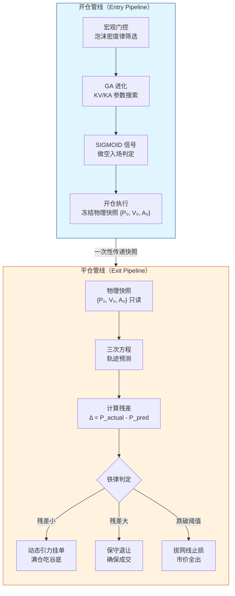
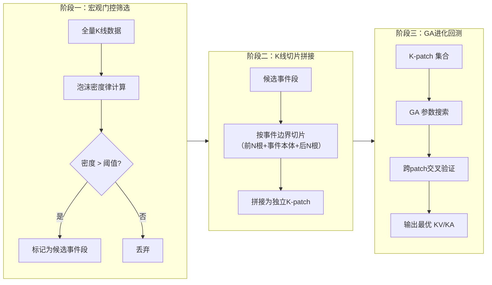
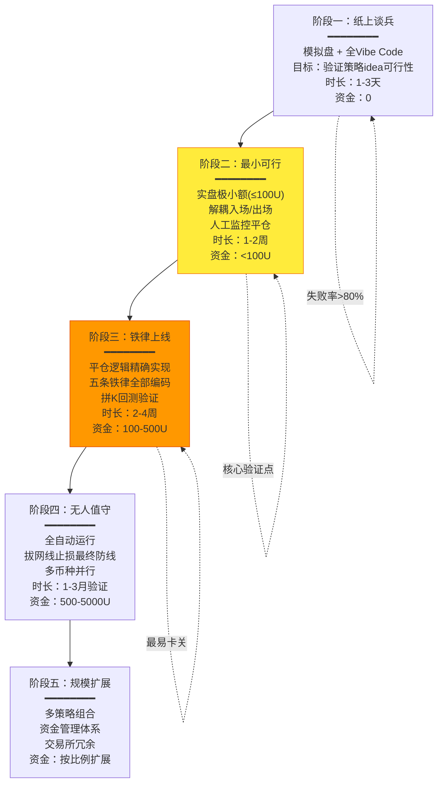

# Vibe Coding × 量化交易：止盈止损系统化理论框架

> **基于视频**：「Vibe coding量化交易的巨坑：止盈止损」— 可乐AI实验室，2026-05-20，时长16′27″
> **系列定位**：量化交易系列第7期（终章）
> **核心实验**：50U极小资金实盘做空 → 单日+50% → 人工平仓失效 → 利润归零

---

## 第一部分：Vibe Coding 在量化交易中的定位

### 1.1 概念定义

> **Vibe Coding 量化交易**（定义）：以自然语言意图驱动、AI 辅助生成量化策略代码的开发范式。开发者通过描述交易直觉（"感觉这里要跌"→"逃顶做空"），由 LLM 翻译为可执行逻辑，经遗传算法（GA）等自动化手段进化参数，最终形成可回测、可部署的策略管线。其核心特征是**意图先行、代码后置、机器校验**，与传统量化开发形成光谱而非二元对立。

传统量化开发与 Vibe Coding 并非替代关系，而是**光谱上的不同位置**：

| 维度 | 传统量化开发 | Vibe Coding 量化 |
|------|-------------|-----------------|
| 策略来源 | 数学建模 → 代码实现 | 交易直觉 → AI 翻译 → 代码 |
| 参数优化 | 手动调参 / 网格搜索 | GA 自动进化 |
| 开发速度 | 天~周 | 分钟~小时 |
| 可解释性 | 高（每个参数有明确含义） | 中低（黑箱倾向） |
| 边界条件理解 | 深（开发者全程参与） | 浅（AI 生成可能遗漏） |
| 适合阶段 | 生产部署、资金管理 | 原型验证、策略探索 |

### 1.2 Vibe Coding 的适用边界

基于视频作者的实战经验（0′00″-3′00″），可明确划分适用与不适用边界：

**适合 Vibe Coding 的模块**（AI 优势区）：
- 策略原型快速验证：用自然语言描述交易想法，AI 生成初版代码
- 遗传算法参数进化：KV/KA 等核心参数的自动化搜索
- 可视化与监控面板：前端类代码生成效率极高
- 回测框架搭建：模板化程度高，AI 擅长

**必须精确实现的模块**（人类主导区）：
- 资金管理：仓位计算、杠杆控制
- 订单执行：滑点控制、交易所 API 对接
- 风险控制：最大回撤限制、黑天鹅应对
- **止盈止损逻辑**：本视频的核心教训——平仓管线必须独立设计

> **作者原话提炼**（~3′00″）："Vibe Coding + GA 可以让入场逻辑进化出优秀表现，但平仓逻辑如果不独立设计，会让整个系统崩溃。"

### 1.3 Vibe Coding 量化交易成熟度模型

```
L1: 实验探索期
├─ 单策略、单币种、模拟盘
├─ AI 生成入场逻辑，人工平仓
├─ 无独立风控管线
└─ 核心风险：过度信任 AI 生成代码

L2: 系统建构期 ← 作者当前阶段
├─ 入场/平仓管线解耦
├─ GA 参数进化引入
├─ 五条铁律初步建立
└─ 核心风险：回测方法论缺陷

L3: 验证稳定期
├─ 多币种、多时间框架并行
├─ 拼K回测体系完善
├─ EMA+半衰期动态风控
└─ 核心风险：过拟合历史数据

L4: 生产部署期
├─ 全自动化无人值守
├─ 拔网线止损作为最终防线
├─ 资金管理分级（小资金→大资金）
└─ 核心风险：黑天鹅、交易所故障
```

当前视频作者处于 L1→L2 过渡期：已走过"入场AI生成+人工平仓"的L1阶段（代价是利润归零），正在构建解耦后的L2体系。

---

## 第二部分：平仓系统解耦理论

### 2.1 开仓与平仓的维度差异

| 维度 | 开仓（Entry） | 平仓（Exit） |
|------|-------------|-------------|
| 时间约束 | 寻找**最佳时机**，可等待 | 已持仓，**每秒都在决策** |
| 信息状态 | 基于历史数据，信息完整 | 持仓后新信息持续涌入 |
| 优化目标 | 最大化入场胜率 | 最大化已实现利润 / 最小化回撤 |
| 数学本质 | 分类问题（开/不开） | 序贯决策问题（何时平） |
| 心态影响 | 冷静（无仓位压力） | 贪婪与恐惧交织 |
| 失败代价 | 错过机会（机会成本） | 实亏（真金白银） |

> **作者论点**（~3′30″）：做空策略本质是"逃顶"，具有**强不对称性**——进场需要精准（在顶部），出场必须更精准（在底部），而这两个目标对模型的数学要求截然不同。

### 2.2 原函数与导函数的"维度鸿沟"

视频中提出了一个关键数学洞察（~6′00″-9′00″）：

```
问题链条：
1. GA 在 Z 空间（导数空间）进化出最优 KV/KA 参数
2. 这些参数描述的是价格变化的"速率"和"加速度"——即导函数特性
3. 但泰勒预测需要的是原函数——包含绝对价格 P₀
4. 降次求导过程抹除了 P₀（常数项在求导中消失）
5. 因此：导函数空间的优秀参数 无法直接 用于原函数空间的轨迹预测
```

> **核心隐喻**（~7′30″）："明朝的剑斩清朝的官"——GA 在导函数空间（明朝）进化出的武器，无法直接用于原函数空间（清朝）的预测任务。

**形式化表述**：

设价格轨迹函数为 P(t)，其泰勒展开为：

```
P(t) = P₀ + P′(0)·t + P″(0)·t²/2! + P‴(0)·t³/3! + ...
```

- GA 进化出的参数（KV/KA）描述的是 P′(t)、P″(t) 的特性——属于**导数空间** Z
- 但价格预测需要 P₀ + 各阶导数的加权和——属于**原函数空间** P
- 从 Z 到 P 的映射不是同构的：P₀ 在求导中丢失，无法从导数信息中恢复

这就是"维度鸿沟"的数学本质。

### 2.3 物理快照 + 残差反馈模式

视频作者提出的解决方案（~9′00″）具有深厚的控制论根基：

> **物理快照（Physical Snapshot）**（定义）：在开仓瞬间冻结一组不可变边界条件 {P₀, V₀, A₀}，其中 P₀ 为开仓价格，V₀ 为瞬时速度（一阶导），A₀ 为瞬时加速度（二阶导）。这组快照作为后续所有轨迹预测的"初始条件"，**全程不可修改**。

此设计与两大控制论经典方法深度呼应：

**1. 模型预测控制（MPC）思想**：
- MPC 在每个时间步求解有限时域最优控制问题
- 物理快照相当于 MPC 的初始状态向量
- 差异在于：MPC 每步重算控制输入，而本方案的快照**不重算**（见第四部分）

**2. 卡尔曼滤波思想**：
- 卡尔曼滤波器维持"预测-更新"循环
- 物理快照提供预测基线（三次方程轨迹）
- 残差（实际价格 - 预测价格）相当于卡尔曼的"新息"（innovation）
- 但本方案只用残差衡量**偏移度**，不用残差修正系数

### 2.4 Pipeline 架构：开仓管线 ∥ 平仓管线



**关键设计原则**：
1. 开仓管线只写快照一次，平仓管线只读快照
2. 两条管线之间唯一的耦合点是物理快照
3. 平仓管线**绝不**回调开仓管线的 GA 进化模块
4. 平仓管线有自己的衰减机制和时间逻辑

---

## 第三部分：五次方程退化与三次轨迹预测

### 3.1 数学直觉：从泰勒展开到三次方程

> **前提声明**：以下为数学直觉层面的论证，非严格数学证明。目标是为"为什么用三次方程"提供可理解的理由。

**泰勒展开的原始形态**：

```
P(t+Δt) = P₀ + P′·Δt + P″·Δt²/2! + P‴·Δt³/3! + P⁗·Δt⁴/4! + P′′′′′·Δt⁵/5! + ...
```

若保留至五阶项，即为五次方程。五次方程在数学上有两个著名困难：
- **阿贝尔-鲁菲尼定理**：一般五次及以上方程无根式解
- **龙格现象**：高阶多项式在区间边缘振荡剧烈，预测失真

**降次到三次的直觉论证**：

1. **信息衰减**：高阶导数（三阶 jerk、四阶 snap）在金融时间序列中噪声占比极高，信噪比随阶数指数下降
2. **局部有效性**：在短时窗口（如15分钟半衰期内），三次已足以捕获价格运动的三种基本模式——方向（一次）、动量（二次）、转折（三次）
3. **可解性与稳定性**：三次方程总有实根（卡尔达诺公式），不会出现高次方程在区间边界的剧烈振荡
4. **奥卡姆剃刀**：三次是能描述"一个拐点"（趋势转向）的最低次数，恰好覆盖做空策略从开仓到平仓的核心叙事——"见顶→下跌→见底"

> **作者观点**（~9′30″）：GA 进化使用的五次泰勒展开信息量已超出实际可用信号范围。实战中三次方程作为轨迹预测的"唯一真源"是充分且必要的。

### 3.2 三次方程作为局部价格轨迹的合理性

三次方程 P(t) = at³ + bt² + ct + d 具备四种核心轨迹形态，恰好对应做空策略的四类市场情景：

| 判别式 Δ | 轨迹形态 | 市场含义 | 策略响应 |
|----------|---------|---------|---------|
| Δ > 0 | 一个实根+两个共轭复根 | 单调趋势（单方向运动） | 持仓等待，满仓吃到底 |
| Δ = 0 | 三重实根（或一个单根+一个重根） | 拐点（趋势转向） | 警惕平仓信号 |
| Δ < 0 | 三个不等实根 | 震荡（多次穿轴） | 缩小期望，保守退让 |
| a ≈ 0 | 退化为二次/一次 | 价格运动衰减 | 按退化规则处理 |

### 3.3 半衰期衰减机制

视频引入的半衰期机制（~14′00″-15′00″）赋予轨迹预测一个**时间衰减**维度：

```
时间轴上的渐进退化：
┌─────────────────────────────────────────────────────┐
│ 开仓时刻 (t=0)                                      │
│   三次方程：P(t) = a₀t³ + b₀t² + c₀t + d₀          │
│   ↓  半衰期 τ = 15分钟                              │
│  t = τ                                              │
│   二次退化：P(t) ≈ b₁t² + c₁t + d₁  (高次项衰减)    │
│   ↓  半衰期 τ = 15分钟                              │
│  t = 2τ                                             │
│   一次退化：P(t) ≈ c₂t + d₂  (只剩线性趋势)         │
│   ↓                                                  │
│  t → ∞                                              │
│   模型失效：价格运动已脱离初始条件可解释范围          │
└─────────────────────────────────────────────────────┘
```

**数学表达**：

```
a(t) = a₀ · e^{-λt}   其中 λ = ln(2)/τ, τ = 15min
b(t) = b₀ · e^{-λt}
c(t) = c₀  （一阶项不衰减，保留方向信息）
d(t) = d₀  （常数项不衰减 = P₀）
```

这个设计的精妙之处：**承认预测能力随时间衰减，但不试图修正**——因为修正意味着引入新噪声。

### 3.4 "不重算"的数学与哲学论证

视频作者反复强调"一旦开仓，绝不重算"（~9′00″-11′00″），这并非固执，而是有深层逻辑支撑：

**数学层面**：
- 重算意味着用新数据重新拟合系数，即用局部样本修正全局模型 → **过拟合**
- 每个时间点的噪声都会永久嵌入系数 → **误差累积**
- 系数修正使模型失去"参照基准"功能——如果系数一直在变，残差衡量的是什么偏移？

**哲学层面**：
- 开仓决策代表了你对市场的一个**命题**（"价格将从P₀下跌"）
- 不断重算等于不断修改这个命题，直到它变成"价格将从当前价格变动"——一个**重言式**（永远正确但毫无信息量）
- 不自欺欺人的态度：接受初始模型的局限，用残差衡量偏离程度，而非修改模型使之拟合现实

> **作者形象比喻**（~10′30″）：不断重算就像考试时不断改答案——每次改的时候都觉得更有把握，但统计上第一次直觉通常是最优的。

---

## 第四部分：五条铁律的理论根基

### 4.1 铁律一：利润硬门槛 — 覆盖双边手续费

| 维度 | 内容 |
|------|------|
| **风险类型** | 交易成本侵蚀（Slippage Cost Risk） |
| **数学原理** | 期望收益 E[R] = P(win) × R_win − P(loss) × R_loss − Cost。若不设门槛，高胜率低利润交易会被手续费吃掉全部 α |
| **形式化** | 平仓条件：P_close − P_open > 2 × Fee_rate × P_open （做空则为反向） |
| **反例** | 微利平仓在统计上等价于"付费陪跑"——赚了价差，亏了手续费 |

### 4.2 铁律二：动态引力挂单 — 自信度函数

这是视频中最具原创性的机制设计（~12′00″）：

> **动态引力挂单**（定义）：挂单价格并非固定值，而是由自信度函数动态计算。自信度函数以预测残差 Δ 为输入，输出挂单激进程度 α ∈ [0,1]，α=1 表示满仓吃谷底，α=0 表示市价全出。

**自信度函数设计**：

```
α(Δ) = σ( -k·|Δ| + b )

其中：
  σ(x) = 1/(1+e^{-x})  —— SIGMOID 函数
  Δ = P_actual - P_pred  —— 预测残差
  k —— 敏感度参数（GA 进化获得）
  b —— 偏置项

行为特征：
  |Δ| → 0   ⇒  σ → 1   ⇒  满仓激进挂单（模型准确，吃全段利润）
  |Δ| → ∞   ⇒  σ → 0   ⇒  保守市价平仓（模型偏移，保本优先）
```

**SIGMOID 在此场景的优势**：
- 平滑过渡：没有硬阈值（避免阈值附近的震荡决策）
- 饱和区：两端平坦，极端残差下决策稳定
- 可微性：兼容 GA 梯度优化

**直觉类比**：自信度函数就像"自动驾驶的跟车系统"——前车轨迹（预测）与实际情况（残差）匹配时，系统自信地保持设定速度；出现偏差时，系统平滑降级到保守模式。

### 4.3 铁律三：绝不重算 — 自信度跌破阈值直接止损

| 维度 | 内容 |
|------|------|
| **风险类型** | 认知偏差风险（Confirmation Bias）——不断修改模型使之符合希望 |
| **数学原理** | 重算 = 在已持有仓位的情况下重新拟合 = 样本选择偏差（只有持仓场景的数据） |
| **阈值逻辑** | 当 α(Δ) < α_min 时，不再给模型"第二次机会"，直接触发止损 |
| **哲学态度** | "自欺欺人"的定义：通过修改判断标准来让失败看起来像成功 |

### 4.4 铁律四：All or Nothing — 微观战斗一次性出清

**博弈论分析**：

| 策略 | 优势 | 劣势 |
|------|------|------|
| **分批平仓** | 平滑价格冲击，适合大资金 | 每一批都是独立赌博，累积决策疲劳，概率上降低总体期望 |
| **一次性出清**（本方案） | 决策清晰，无后续心理负担，适合小资金 | 可能错过"再跌一段"的利润 |

对于视频作者的小资金（50U）做空场景：
- 分批平仓的边际收益 ≈ 0（手续费吃掉微利）
- 分批平仓引入 N 次决策，每次都有出错概率 → 串联可靠性 = p^N
- 一次性出清把"战斗"限定在一个封闭回合内，符合做空策略的离散事件本质

> **军事隐喻**：这不是阵地战（持续持有+分批减仓），而是**狙击战**——一枪一命，打完就撤。

### 4.5 铁律五：拔网线止损 — EMA + 半衰期平滑

> **拔网线止损**（定义）：当极端市场条件触发时，放弃所有优雅的挂单逻辑，以市价单全部出清。名称源自极端情况下的终极手段——就像拔掉网线切断所有连接。

**EMA + 半衰期双重平滑机制**：

```
平滑价格序列：P_smooth(t) = EMA(P_raw(t), α_ema)
异常判定：     |P_raw - P_smooth| > k × σ_half_life

其中 σ_half_life 以 15分钟半衰期衰减：
  σ(t) = σ₀ · e^{-λt}, λ = ln(2)/15min
```

**为什么需要双重平滑**：
- EMA 过滤高频噪声（避免单笔异常成交触发误判）
- 半衰期使异常判据随持仓时间收紧——持仓越久，对偏离越敏感
- 这种设计天然实现了"持仓时间越长 → 止损触发越容易"的保守化衰减

**防误判设计哲学**：宁可晚 1 秒止损，不可错 1 次止损。因为错杀意味着在价格正常运动时错误平仓，而延迟止损的代价仅是多滑几个 tick——在极端行情下，这两个错误的代价完全不对称。

---

## 第五部分：做空策略的 GA 回测方法论

### 5.1 做空 vs 做多的 GA 搜索空间差异

| 维度 | 做多 GA | 做空 GA |
|------|--------|--------|
| 事件分布 | 均匀（上涨可发生在任何时间） | 稀疏（顶部事件稀有） |
| 样本量 | 充足 | 稀少（历史顶部事件远少于底部） |
| 过拟合风险 | 中等 | 极高（小样本 + 高维参数） |
| 时间框架 | 可与绝对时间关联 | **必须与绝对时间解耦** |
| 适应度函数 | 收益率 × 胜率 | 收益率 × 胜率 × 事件稀有度惩罚 |

做空策略的 GA 面临的**不对称挑战**：历史数据中顶部事件远少于底部事件，导致训练样本极度不平衡。传统按时间均匀切片的数据集构建方法在此失效。

### 5.2 离散事件驱动策略的特殊性

视频作者指出的关键洞察（~14′00″-15′00″）：

> 做空策略是**离散事件驱动**的——策略只在特定条件触发时才启动生命周期，触发时机与绝对时间（如"每天9:30"）无关，只与市场状态（如"泡沫密度达到阈值"）有关。

这导致传统时间序列回测的三个根本失败：

1. **全生命周期回测无意义**：如果 90% 的时间策略不触发，那 90% 的回测数据是噪声
2. **连续时间窗不可用**：固定窗口（如滚动 30 天）会切割事件的生命周期
3. **绝对时间标签有害**：策略不应该学习"周三不交易"这种虚假的季节性模式

### 5.3 拼K（K-Patch）方法详解

视频提出的创新回测方法论（~15′00″-16′00″）：



**拼K三原则**：
1. **切片规则**：以前 N 根 K 线为上下文窗口，事件本体为决策窗口，后 N 根为结果窗口
2. **拼接逻辑**：每个 K-patch 独立参与 GA 进化，互不污染（patch 之间无时序依赖）
3. **验证方式**：留一Patch交叉验证（Leave-One-Patch-Out），而非留一日期

### 5.4 泡沫密度律在宏观门控中的作用

> **泡沫密度律**（定义）：一种衡量市场价格脱离基本面程度的量化指标，通过价格加速度（二阶导）与成交量背离度的复合计算，识别"泡沫化"的市场状态。

**门控条件设计**：

```
Gate(P, V, t) = 1  if  ρ_bubble(P, V) > θ_gate
               = 0  otherwise

其中 ρ_bubble 是泡沫密度函数：
  ρ = f(P″/σ_P, V/V_ma, RSI_extreme)
```

在视频作者的做空框架中，泡沫密度律充当**宏观门控**角色：
- 只有泡沫密度超过阈值的时刻，才激活做空策略的入场判定
- 这本质是对 GA 搜索空间的**预剪枝**——不让 GA 在垃圾时间搜索
- 将"何时做空"的连续问题转化为"泡沫→做空"的条件概率问题

---

## 第六部分：Vibe Coding 量化交易实践原则

### 6.1 十条实践原则（Do's and Don'ts）

| # | 原则 | 类型 | 依据 |
|---|------|------|------|
| 1 | **入场可 vibe，出场必精确** | DO | 视频核心教训：50%利润因人工平仓归零 |
| 2 | **开仓平仓管线完全解耦** | DO | 两者数学目标不同，不可共享参数 |
| 3 | **开仓即冻结物理快照，后续只读** | DO | 防止自欺欺人式重算 |
| 4 | **小资金先验证，不急于放大** | DO | 50U实验证明小资金可暴露系统性缺陷 |
| 5 | **GA 回测必须用拼K法，不用连续时间窗** | DO | 离散事件驱动策略的特殊要求 |
| 6 | **永远设置拔网线止损作为最后防线** | DO | 极端行情比优雅逻辑更致命 |
| 7 | **不要在持仓期间修改策略代码** | DON'T | 等于在飞行中更换引擎 |
| 8 | **不要用同一套 GA 参数同时优化入场和出场** | DON'T | 多目标优化的帕累托前沿可能在入场和出场之间妥协 |
| 9 | **不要过度信任 Vibe Code 生成的资金管理代码** | DON'T | 这是 LLM 最不擅长的精确计算领域 |
| 10 | **不要在情绪激动时（大盈或大亏后）做任何 Vibe Code 修改** | DON'T | 情绪驱动的 prompt 会产生有偏代码 |

### 6.2 五个反模式（Anti-Patterns）

**反模式 1：「一把梭」综合症**

| 维度 | 描述 |
|------|------|
| **症状** | 用同一个 Prompt 让 AI 生成完整的"入场+资金管理+出场"策略 |
| **案例** | "写一个做空BTC的策略，自动判断入场、计算仓位、止盈止损" → 生成一体化函数，改一处崩全局 |
| **修复** | 拆分为独立模块，分别 vibe code + 分别验证，仅通过物理快照耦合 |
| **视频依据** | ~3′00″ 解耦论点 |

**反模式 2：「永动机」幻觉**

| 维度 | 描述 |
|------|------|
| **症状** | 不断用新数据重算模型系数，相信"越修正越准" |
| **案例** | 每根新K线出现后重新拟合三次方程系数，误以为在"自适应"，实则在过拟合噪声 |
| **修复** | 冻结初始快照，只用残差衡量偏移，不做系数修正 |
| **视频依据** | ~9′00″ 不重算论点 |

**反模式 3：「时间万能」谬误**

| 维度 | 描述 |
|------|------|
| **症状** | 在离散事件策略中使用连续时间回测（如按日滚动窗口） |
| **案例** | 用过去30天数据做滚动GA优化做空策略 → 90%训练数据里策略根本没触发，GA在噪声中搜索 |
| **修复** | 拼K方法：只在策略实际触发的时间片段中构建回测集 |
| **视频依据** | ~15′00″ 拼K论点 |

**反模式 4：「优雅陷阱」**

| 维度 | 描述 |
|------|------|
| **症状** | 过度设计挂单逻辑（分批、冰山、TWAP等），在极端行情下反而无法成交 |
| **案例** | 设计了三层挂单网格，结果暴跌时三层都没吃到，因为市场直接穿透了所有挂单价 |
| **修复** | 保留"拔网线止损"作为终极手段；小资金用 All or Nothing |
| **视频依据** | ~13′30″ 拔网线止损论点 |

**反模式 5：「降维打击自己」**

| 维度 | 描述 |
|------|------|
| **症状** | 用导函数空间（Z空间）的参数直接驱动原函数空间的决策 |
| **案例** | GA 进化出的最优 KV/KA（描述速度/加速度）直接设定为平仓阈值，忽略了绝对价格 P₀ |
| **修复** | 明确区分 Z 空间（GA搜索）和 P 空间（轨迹预测），通过物理快照桥接 |
| **视频依据** | ~6′00″ 维度鸿沟论点 |

### 6.3 量化模块 Vibe Coding 适用性评估矩阵

| 模块 | 评分(1-5) | 适合度 | 风险等级 | 备注 |
|------|-----------|--------|---------|------|
| 策略想法原型 | 5 | ★★★★★ | 低 | Vibe Coding 的最佳场景 |
| GA 参数进化框架 | 4 | ★★★★☆ | 中 | 需要正确的适应度函数设计 |
| 可视化仪表盘 | 5 | ★★★★★ | 低 | 纯前端代码，AI 擅长的领域 |
| 回测框架搭建 | 4 | ★★★★☆ | 中 | 模板化强但需注意拼K等特殊逻辑 |
| 技术指标计算 | 3 | ★★★☆☆ | 中 | 公式明确但数值精度要求高 |
| 入场信号生成 | 3 | ★★★☆☆ | 中高 | 逻辑可 vibe，但边界条件需人工审查 |
| 平仓/止盈止损 | 1 | ★☆☆☆☆ | 极高 | **本视频的核心教训：必须精确设计** |
| 资金管理 | 1 | ★☆☆☆☆ | 极高 | 涉及真实资金，不容试错 |
| 交易所 API 对接 | 2 | ★★☆☆☆ | 高 | API 文档可能过时，需人工验证 |
| 风险监控告警 | 2 | ★★☆☆☆ | 高 | 漏报的代价是实亏 |

### 6.4 从原型到生产的渐进路线图



**各阶段里程碑与退出条件**：

| 阶段 | 进入条件 | 退出条件 | 核心验证项 |
|------|---------|---------|-----------|
| P1 纸上谈兵 | 策略 idea 明确 | 回测夏普 > 1.0 | 策略是否具备统计优势 |
| P2 最小可行 | P1 通过 | 连续5日无人工干预平仓事故 | 作者从这个阶段跌倒——平仓可控性 |
| P3 铁律上线 | P2 通过 | 拼K回测夏普 > 1.5，最大回撤 < 20% | 五条铁律是否覆盖极端场景 |
| P4 无人值守 | P3 通过 | 连续1月无人工干预，损益曲线平稳 | 全自动化可靠性 |
| P5 规模扩展 | P4 通过 | 资金曲线按比例增长，无容量瓶颈 | 策略容量与市场冲击 |

---

## 附录：关键术语索引

| 术语 | 英文/缩写 | 定位 | 文中首次出现 |
|------|----------|------|-------------|
| 物理快照 | Physical Snapshot | 开仓时冻结的 {P₀, V₀, A₀} | §2.3 |
| Z空间 | Z-Space | GA 进化的导数参数空间 | §2.2 |
| 维度鸿沟 | Dimension Gap | 导函数空间与原函数空间的不可通约性 | §2.2 |
| 拼K | K-Patch | 离散事件回测的切片拼接方法 | §5.3 |
| 动态引力挂单 | Dynamic Gravity Order | 基于残差的自信度驱动挂单 | §4.2 |
| 拔网线止损 | Kill-Switch Stop-Loss | 放弃优雅逻辑的终极市价出清 | §4.5 |
| 半衰期衰减 | Half-Life Decay | τ=15min 的指数衰减机制 | §3.3 |
| 泡沫密度律 | Bubble Density Law | 宏观门控的筛选指标 | §5.4 |
| 三次轨迹预测 | Cubic Trajectory | 基于三次方程的局部价格预测 | §3.1 |
| 五条铁律 | Five Iron Laws | 平仓逻辑的不可违背原则 | §4 |

---

> **文档版本**：v1.0 | **生成日期**：2026-05-22 | **基于视频**：[可乐AI实验室] Vibe coding量化交易的巨坑：止盈止损 (16′27″)
> **作者声明**：本文所有核心论点来源于视频作者，理论框架的构建是对视频内容的系统化、结构化和形式化，不包含独立于视频之外的新概念创造。
