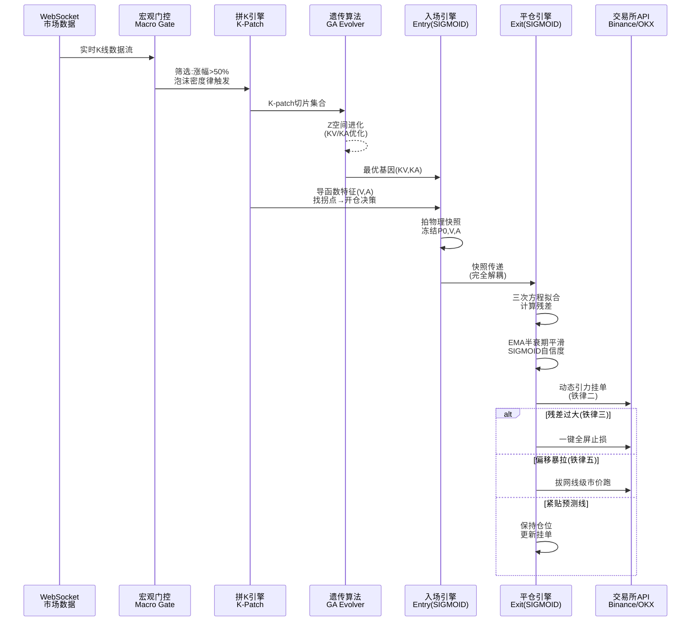

# 可乐AI实验室「星空策略」工具链全景分析与技术选型指南

> **分析对象**：可乐AI实验室 YouTube 频道量化交易系列（第1-7期），核心锚定第7期 "Vibe coding量化交易的巨坑：止盈止损"
> **分析日期**：2026-05-22
> **分析维度**：Vibe Coding工具链 | 量化技术栈 | 算法实现 | 架构推断 | 复刻推荐 | 风险约束

---

## 目录

1. [第一部分：Vibe Coding 工具链对比](#第一部分vibe-coding-工具链对比)
2. [第二部分：量化交易技术栈分析](#第二部分量化交易技术栈分析)
3. [第三部分：核心算法实现工具](#第三部分核心算法实现工具)
4. [第四部分：作者技术栈推断](#第四部分作者技术栈推断)
5. [第五部分：复刻工程的技术选型推荐](#第五部分复刻工程的技术选型推荐)
6. [第六部分：止盈止损实现的技术约束分析](#第六部分止盈止损实现的技术约束分析)

---

## 第一部分：Vibe Coding 工具链对比

### 1.1 AI编程工具横向对比

视频标签中明确包含 `#ai编程`、`#cursor`、`#vibecoding`，第3期标题直接标注"纯Cursor实现"。以下以**量化交易开发场景**为基准进行对比评分（满分10分）：

| 维度 | Cursor | Claude Code | GitHub Copilot | Windsurf | Aide |
|------|--------|-------------|----------------|----------|------|
| **代码生成质量** | 8.5 | 9.0 | 7.5 | 8.0 | 6.5 |
| **金融领域知识** | 7.0 | 8.5 | 6.5 | 7.0 | 5.5 |
| **多文件重构能力** | 8.0 | 9.0 | 7.0 | 8.5 | 6.0 |
| **Debug/排错能力** | 7.5 | 8.5 | 6.5 | 7.5 | 5.5 |
| **数学推理能力** | 7.0 | 9.0 | 6.0 | 7.5 | 5.0 |
| **长上下文管理** | 7.5 | 9.5 | 7.0 | 8.0 | 5.5 |
| **终端集成** | 7.0 | 9.5 | 6.0 | 7.0 | 6.5 |
| **学习曲线** | 低 | 中 | 低 | 低 | 中 |
| **价格（月）** | $20 Pro | $20/$200 | $10/$39 | $15 Pro | 开源免费 |
| **量化场景综合** | **7.6** | **8.9** | **6.6** | **7.6** | **5.8** |

#### 量化交易特定场景深度评分

| 场景 | Cursor | Claude Code | Copilot | Windsurf |
|------|--------|-------------|---------|----------|
| 泰勒展开/多项式拟合代码生成 | 7 | 9 | 6 | 7 |
| 遗传算法（DEAP/PyGAD）集成 | 8 | 9 | 6 | 7 |
| SIGMOID解耦架构设计 | 7 | 9 | 6 | 8 |
| 交易所API对接代码 | 8 | 8 | 7 | 7 |
| WebSocket实时数据流 | 7 | 8 | 7 | 7 |
| 回测框架调试 | 7 | 8 | 6 | 7 |

**量化交易开发的核心瓶颈不是单文件代码生成，而是数学概念到工程实现的翻译能力、复杂系统的架构解耦设计、以及跨多文件的调试——这些恰恰是 Claude Code 的强项。**

#### 作者选择Cursor的可能原因分析

基于视频信息推断，作者选择Cursor而非Claude Code的原因：

| 推测原因 | 置信度 | 依据 |
|----------|--------|------|
| **上手门槛低** | 高 | Cursor是图形化IDE，GUI文件树+内联编辑+Chat面板，无需学习CLI命令 |
| **视频创作友好** | 高 | 可视化编辑过程更适合录屏展示，Claude Code纯终端操作不便视频呈现 |
| **熟悉度** | 中 | 系列早期（2025年）Claude Code尚未普及，Cursor是Vibe Coding主流入口 |
| **Inline Edit体验** | 中 | Cursor的Tab补全和内联diff对快速迭代友好，符合"凭感觉写代码"的行为模式 |
| **Tags误导可能** | 中 | 标签含`#ai编程 #cursor`，但第4期标题提到"产品思维+Gemini"，第2期提到"借鉴DeepSeek"，实际可能多工具混用 |

> **待验证**：作者在16个Vibe Coding实战技巧视频中提到了Context7 MCP、状态机、Skill库概念——这些更接近Claude Code生态而非Cursor原生功能，暗示作者可能同时使用多款工具。

### 1.2 AI模型对比：数学推理能力

视频核心涉及**泰勒展开、遗传算法、SIGMOID函数、三次方程拟合、EMA平滑、残差计算**等数学概念，模型对这些概念的**理解深度和代码翻译准确性**直接决定开发效率。

| 评估维度 | Claude Sonnet 4 | Claude Opus 4 | GPT-4o | DeepSeek V3 | Gemini 2.5 Pro |
|----------|-----------------|---------------|--------|-------------|-----------------|
| **泰勒展开实现** | 9 | 9.5 | 7.5 | 8 | 8 |
| **遗传算法编码** | 8.5 | 9 | 7 | 7.5 | 7 |
| **SIGMOID数学理解** | 9 | 9 | 8 | 8 | 8 |
| **三次方程拟合** | 9 | 9 | 7.5 | 8 | 7.5 |
| **控制理论（MPC/Kalman）** | 8.5 | 9 | 7 | 7 | 7.5 |
| **导数/降次概念** | 9 | 9.5 | 8 | 7.5 | 8 |
| **代码可靠性** | 8.5 | 9 | 7.5 | 7 | 7.5 |
| **架构设计建议** | 9 | 9.5 | 7 | 7.5 | 8 |
| **长上下文一致性** | 9 | 9.5 | 7 | 8.5 | 9 |
| **金融领域偏见** | 低 | 低 | 中 | 低 | 中 |
| **API成本($/1M token)** | $3/$15 | $15/$75 | $2.5/$10 | $0.27/$1.1 | $1.25/$5 |

**结论**：对于视频中涉及的数学密集型量化开发，**Claude Opus 4 是最强选择**，其次是 Claude Sonnet 4。在成本敏感场景下，DeepSeek V3 性价比最优但数学推理略逊。作者标签中提到Claude/Sonnet和Anthropic，推断实际使用Claude系列模型。

### 1.3 Vibe Coding工具链选型决策树

```
需要图形化IDE？
├── 是 → Cursor (入门友好，适合录视频)
│   └── 需要更强数学推理？→ Cursor + Claude API 模型
└── 否 → Claude Code (最强数学+架构能力)
    └── 预算敏感？→ 搭配 DeepSeek V3 处理简单任务
```

---

## 第二部分：量化交易技术栈分析

### 2.1 回测框架选型

视频提出了独特的 **"拼K回测"(K-patch)** 需求：离散事件驱动、只对符合宏观门控条件的K线切片做进化回测。这对回测框架提出非常规要求。

| 维度 | Backtrader | Vnpy | Zipline-Reloaded | VectorBT | 自研 |
|------|------------|------|------------------|----------|------|
| **离散事件驱动支持** | 原生 | 原生 | 基于时间 | 基于时间 | 完全可控 |
| **自定义K线拼接** | 需Hack | 需Hack | 困难 | 不支持 | 原生支持 |
| **做空/永续合约** | 需自定义 | 原生支持 | 不支持 | 不支持 | 完全可控 |
| **遗传算法集成** | 需自行对接 | 需自行对接 | 不支持 | 有优化模块 | 原生支持 |
| **SIGMOID仓位管理** | 需自定义Sizer | 需自定义 | 不支持 | 不支持 | 原生支持 |
| **残差/偏移计算** | 需自定义Analyzer | 需自定义 | 困难 | 不支持 | 原生支持 |
| **多币种并发** | 支持 | 原生支持 | 有限 | 有限 | 完全可控 |
| **手续费/滑点模型** | 支持 | 支持 | 支持 | 支持 | 完全可控 |
| **Python生态** | 是 | 是 | 是 | 是 | 是 |
| **Go生态** | 否 | 否 | 否 | 否 | 是 |
| **社区活跃度** | 中（维护放缓） | 高（中文社区） | 中 | 高 | N/A |
| **学习曲线** | 中 | 高 | 中 | 中 | N/A |
| **适合"拼K回测"** | ⭐⭐ | ⭐⭐ | ⭐ | ⭐ | ⭐⭐⭐⭐⭐ |

#### 针对视频需求的推荐方案

**推荐：自研轻量回测核心 + 可选框架包装**

理由：
1. **"拼K回测"是高度定制化的回测模式**，市面上没有任何现成框架原生支持"宏观门控筛选→切片拼合→GA进化"这条流水线
2. **视频中多次强调"极简"（第5期主题）**，作者倾向精简而非依赖重型框架
3. 自研核心约500-800行Python即可覆盖：事件队列、K-patch拼合、残差计算、SIGMOID仓位管理、手续费模拟

推荐自研核心架构：

```python
# 拼K回测核心：事件驱动的K线切片回测引擎
from dataclasses import dataclass
from typing import List, Optional, Callable
import numpy as np

@dataclass
class KPatch:
    """K线切片：从宏观门控筛选出的独立事件"""
    symbol: str
    klines: np.ndarray          # OHLCV数据
    entry_index: int            # 开仓K线位置
    P0: float                   # 开仓价格快照
    V: float                    # 一阶导数(速度)快照
    A: float                    # 二阶导数(加速度)快照
    macro_gate_score: float     # 宏观门控评分

@dataclass
class Position:
    """仓位状态：完全解耦的平仓管线"""
    patch: KPatch
    sigmoid_confidence: float = 1.0
    cubic_coeffs: Optional[np.ndarray] = None  # 三次方程系数
    unrealized_pnl: float = 0.0

class KPatchBacktestEngine:
    """拼K回测引擎：事件驱动，非时间序列"""
    
    def __init__(self, macro_gate: Callable, ga_evolver: Callable):
        self.macro_gate = macro_gate          # 宏观门控函数
        self.ga_evolver = ga_evolver          # GA进化函数
        self.patches: List[KPatch] = []
        self.positions: List[Position] = []
        
    def collect_patches(self, market_data: dict) -> List[KPatch]:
        """步骤1：宏观门控筛选 + K线切片拼合"""
        patches = []
        for symbol, data in market_data.items():
            # 只取近期涨幅超50%的三周内K线
            if self.macro_gate(data):
                slices = self._extract_high_momentum_slices(data)
                patches.extend(slices)
        return patches
    
    def run_ga_evolution(self, patches: List[KPatch]) -> dict:
        """步骤2：对拼合的K-patch做GA进化"""
        return self.ga_evolver(patches)
    
    def simulate_exit(self, position: Position) -> float:
        """步骤3：使用解耦的平仓管线模拟出场"""
        # 核心：原函数计算残差，SIGMOID控制平仓自信度
        pass
```

### 2.2 交易所API接入方案

视频策略为**多币种做空永续合约**，需要支持做空、止盈止损订单、永续合约。

| 维度 | Binance | OKX | Hyperliquid | dYdX |
|------|---------|-----|-------------|------|
| **永续合约** | USDⓈ-M 永续 | 永续合约 | 原生永续 | 原生永续 |
| **做空支持** | 原生 | 原生 | 原生 | 原生 |
| **市价止盈止损** | ✅ | ✅ | ✅ | ✅ |
| **限价止盈止损** | ✅ | ✅ | ✅ | ✅ |
| **条件单** | ✅ (OCO) | ✅ (OCO) | ✅ (TP/SL) | ✅ |
| **追踪止损** | ❌ 需自实现 | ✅ 原生追踪止损 | ❌ 需自实现 | ❌ 需自实现 |
| **WebSocket稳定性** | ⭐⭐⭐⭐ | ⭐⭐⭐⭐ | ⭐⭐⭐ | ⭐⭐⭐ |
| **做空资金费率** | 8h结算 | 8h结算 | 1h/8h | 1h/8h |
| **流动性（BTC/ETH）** | 极高 | 高 | 中 | 中 |
| **API文档质量** | ⭐⭐⭐⭐⭐ | ⭐⭐⭐⭐ | ⭐⭐⭐ | ⭐⭐⭐ |
| **Python SDK** | python-binance | okx-python | 官方SDK | dydx-v4-python |
| **KYC要求** | 需KYC | 需KYC | 无需KYC | 无需KYC |
| **适合星空策略** | ⭐⭐⭐⭐⭐ | ⭐⭐⭐⭐ | ⭐⭐⭐ | ⭐⭐⭐ |

**关键发现：视频五条铁律中的"动态引力挂单"和"拔网线级止损"对交易所订单类型的依赖分析**

| 铁律 | 所需订单类型 | Binance支持 | OKX支持 | 备注 |
|------|-------------|-------------|---------|------|
| 铁律一：利润覆盖手续费 | 计算功能 | N/A | N/A | 纯本地计算 |
| 铁律二：动态引力挂单 | 限价止盈 + 动态修改 | ✅ | ✅ | 需WebSocket实时更新挂单价 |
| 铁律三：绝不重算+一键止损 | 市价止损/全部平仓 | ✅ | ✅ | cancel all + market close |
| 铁律四：All or Nothing | 全部平仓(非减仓) | ✅ | ✅ | closePosition API |
| 铁律五：拔网线止损 | 市价单+超时保护 | ✅ | ✅ | 特别注意：拔网线场景下需本地超时+交易所超时双重保障 |

#### 推荐方案

**首选 Binance + CCXT统一接口层**

```python
# CCXT统一API层：支持多交易所切换
import ccxt
import asyncio

class ExchangeGateway:
    """交易所网关：统一接口 + 止盈止损订单管理"""
    
    def __init__(self, exchange_id: str = 'binance', testnet: bool = True):
        self.exchange = getattr(ccxt, exchange_id)({
            'apiKey': 'YOUR_API_KEY',
            'secret': 'YOUR_SECRET',
            'enableRateLimit': True,
            'options': {'defaultType': 'swap'},  # 永续合约
        })
        if testnet:
            self.exchange.set_sandbox_mode(True)
    
    async def place_dynamic_take_profit(
        self, symbol: str, side: str, amount: float,
        base_price: float, confidence: float
    ) -> dict:
        """
        铁律二：动态引力挂单
        confidence=1.0 → 挂单在最低点（榨干利润）
        confidence→0   → 挂单向市价靠拢（确保成交）
        """
        target_profit = self.cubic_lowest_point  # 三次方程低谷
        gravitational_discount = (1 - confidence) * 0.05  # 最大5%退让
        adjusted_tp = target_profit * (1 - gravitational_discount)
        return await self.exchange.create_order(
            symbol, 'limit', side, amount, adjusted_tp,
            {'reduceOnly': True, 'timeInForce': 'GTC'}
        )
    
    async def emergency_exit(self, symbol: str):
        """铁律五：拔网线级止损"""
        await self.exchange.cancel_all_orders(symbol)
        position = await self.exchange.fetch_position(symbol)
        if position['contracts'] > 0:
            await self.exchange.create_market_order(
                symbol, 'sell' if position['side'] == 'long' else 'buy',
                position['contracts'], {'reduceOnly': True}
            )
```

### 2.3 数据源方案

| 维度 | CCXT | Binance WS | CryptoDataDownload | Kaggle | 自建 |
|------|------|-----------|-------------------|--------|------|
| **K线精度** | 1m/5m/15m/1h | 1s起 | 日线为主 | 混合 | 自定义 |
| **历史深度** | 各所不同 | 1000条/请求 | 全量 | 全量 | 取决存储 |
| **实时性** | REST轮询 | WS推送 | 离线 | 离线 | WS推送 |
| **多币种** | ✅ | ✅ | 有限 | ✅ | ✅ |
| **做空标记** | 无 | 无 | 无 | 无 | 可自定义 |
| **泡沫标记** | 无 | 无 | 无 | 无 | 可自定义 |
| **集成难度** | 低 | 中 | 低 | 低 | 高 |

#### 时间刻度数据库选型

| 维度 | TimescaleDB | InfluxDB | ClickHouse | PostgreSQL原生 |
|------|-------------|----------|------------|----------------|
| **K线数据模型** | 天然支持(超表) | 时间序列原生 | 列存+时序 | 通用 |
| **聚合查询(1m→15m)** | SQL time_bucket | Flux/Task | SQL | SQL GROUP BY |
| **压缩率** | 90%+ | 90%+ | 95%+ | 一般 |
| **窗口函数(EMA)** | ✅ | ⚠️ 有限 | ✅ | ✅ |
| **与Python集成** | psycopg2/SQLAlchemy | influxdb-client | clickhouse-driver | psycopg2 |
| **运维复杂度** | 低(PostgreSQL扩展) | 中 | 中-高 | 低 |
| **适合场景** | K线存储+复杂聚合 | IoT/监控指标 | 大规模分析 | 轻量级场景 |

**推荐：TimescaleDB**（基于PostgreSQL，与Python生态无缝集成，支持超表自动分区和压缩，窗口函数支持EMA计算）

```sql
-- K线超表定义（TimescaleDB）
CREATE TABLE klines (
    symbol VARCHAR(20) NOT NULL,
    interval VARCHAR(5) NOT NULL,  -- '1m','5m','15m','1h'
    open_time TIMESTAMPTZ NOT NULL,
    open DOUBLE PRECISION,
    high DOUBLE PRECISION,
    low DOUBLE PRECISION,
    close DOUBLE PRECISION,
    volume DOUBLE PRECISION,
    -- 星空策略扩展字段
    bubble_density_score DOUBLE PRECISION,  -- 泡沫密度律评分
    macro_gate_flag BOOLEAN DEFAULT false,   -- 宏观门控标记
    PRIMARY KEY (symbol, interval, open_time)
);
SELECT create_hypertable('klines', 'open_time');
```

---

## 第三部分：核心算法实现工具

### 3.1 SIGMOID实现方案对比

| 方案 | 数学精度 | 性能 | 集成难度 | 依赖体积 | 推荐场景 |
|------|---------|------|---------|---------|---------|
| **SciPy scipy.special.expit** | 高 | 高(C实现) | 极低 | 中 | 生产环境首选 |
| **NumPy 自实现 1/(1+exp(-x))** | 高 | 高(向量化) | 极低 | 无额外 | 轻量依赖 |
| **PyTorch torch.sigmoid** | 高 | GPU加速 | 中 | 极大 | GPU加速场景 |
| **TensorFlow tf.sigmoid** | 高 | GPU加速 | 中 | 极大 | TF生态 |
| **手写C扩展** | 高 | 极高 | 高 | 极小 | 极致性能需求 |

**推荐**：`scipy.special.expit`（C实现、数值稳定、依赖体积适中）

> 视频中SIGMOID的双重用途（仓位管理+平仓自信度）意味着至少需要两个独立参数化的SIGMOID函数，无需深度学习框架。

```python
from scipy.special import expit  # 数值稳定的SIGMOID

def position_sigmoid(deviation: float, k: float = 1.0, x0: float = 0.0) -> float:
    """平仓自信度SIGMOID：残差→自信度"""
    return 1.0 - expit(k * (abs(deviation) - x0))
    # deviation=0  → confidence≈1.0（紧贴预测线，坚持等）  
    # deviation=∞  → confidence≈0.0（偏移极大，退出）

def entry_sigmoid(signal: float, k: float = 1.0, x0: float = 0.0) -> float:
    """开仓仓位管理SIGMOID：独立管线，与平仓完全解耦"""
    return expit(k * (signal - x0))
```

### 3.2 遗传算法框架对比

视频特征：GA在 **Z空间（KV/KA敏感度）** 中进化，采用"拼K回测"作为适应度函数。

| 维度 | DEAP | PyGAD | geneticalgorithm | 自实现 |
|------|------|-------|------------------|--------|
| **自定义基因编码** | 极灵活 | 中 | 低（固定实数） | 完全可控 |
| **自定义适应度函数** | 原生支持 | 原生支持 | 有限 | 完全可控 |
| **Z空间进化** | 需自定义 | 需自定义 | 不支持 | 原生支持 |
| **多目标优化** | ✅ NSGA-II | ⚠️ 有限 | ❌ | 需自实现 |
| **并行适应度计算** | ✅ multiprocessing | ✅ 多线程 | ❌ | 需自实现 |
| **与量化回测集成** | 中 | 中 | 低 | 原生深度集成 |
| **学习曲线** | 高 | 低 | 极低 | 中 |
| **社区成熟度** | 极高(科研标准) | 中 | 低 | N/A |
| **文档/示例** | ⭐⭐⭐⭐ | ⭐⭐⭐ | ⭐⭐ | N/A |
| **Golang替代** | ❌ (Python) | ❌ (Python) | ❌ (Python) | ✅ go-ea/gago |

**推荐方案：DEAP + 自定义算子**

DEAP是科研级GA框架，原生支持自定义基因编码（Z空间KV/KA编码）、自定义交叉变异算子、多目标优化（NSGA-II），并行适应度计算可对接"拼K回测"引擎。

```python
from deap import base, creator, tools, algorithms
import random
import numpy as np

# Z空间基因：KV(K线速度敏感度) + KA(K线加速度敏感度)
creator.create("FitnessMax", base.Fitness, weights=(1.0,))
creator.create("Individual", list, fitness=creator.FitnessMax)

toolbox = base.Toolbox()
# 基因编码：KV ∈ [0.01, 10.0], KA ∈ [0.001, 5.0]
toolbox.register("KV", random.uniform, 0.01, 10.0)
toolbox.register("KA", random.uniform, 0.001, 5.0)
toolbox.register("individual", tools.initCycle, creator.Individual,
                 (toolbox.KV, toolbox.KA), n=1)
toolbox.register("population", tools.initRepeat, list, toolbox.individual)

def kpatch_fitness(individual, patches, engine):
    """拼K回测适应度函数：在K-patch集合上评估基因"""
    kv, ka = individual[0], individual[1]
    total_pnl = 0.0
    win_rate = 0
    for patch in patches:
        result = engine.simulate(patch, kv, ka)  # 独立管线
        total_pnl += result.pnl
        if result.pnl > 0:
            win_rate += 1
    # 同时优化总收益和胜率（可通过NSGA-II多目标）
    return (total_pnl * (win_rate / len(patches)),)

toolbox.register("evaluate", kpatch_fitness, 
                 patches=patches, engine=kpatch_engine)
toolbox.register("mate", tools.cxSimulatedBinaryBounded, 
                 eta=15.0, low=[0.01, 0.001], up=[10.0, 5.0])
toolbox.register("mutate", tools.mutPolynomialBounded,
                 eta=10.0, low=[0.01, 0.001], up=[10.0, 5.0], indpb=0.2)
toolbox.register("select", tools.selTournament, tournsize=3)

# 进化
population = toolbox.population(n=100)
algorithms.eaSimple(population, toolbox, cxpb=0.7, mutpb=0.2, ngen=50)
```

### 3.3 三次方程拟合与残差计算

| 方案 | 精度 | 性能 | 代码量 | 依赖 | 适用场景 |
|------|------|------|--------|------|---------|
| **NumPy polyfit(deg=3)** | 高 | 高 | 1行 | NumPy | 单变量多项式 |
| **SciPy curve_fit** | 极高 | 中 | 5-10行 | SciPy | 自定义拟合函数 |
| **手写最小二乘** | 可控 | 最高 | 20-30行 | NumPy | 极致定制 |
| **scipy.optimize.minimize** | 极高 | 低 | 10行 | SciPy | 带约束拟合 |

**推荐：NumPy polyfit(deg=3)**（一行代码、性能最优、视频场景下的局部三次方程拟合完全满足精度要求）

```python
import numpy as np

# 局部K线价格轨迹的三次方程拟合
def fit_cubic_trajectory(prices: np.ndarray, times: np.ndarray) -> tuple:
    """
    输入：最近N个K线的价格序列
    输出：三次方程系数 a*t^3 + b*t^2 + c*t + d
    """
    coeffs = np.polyfit(times, prices, deg=3)  # [a, b, c, d]
    return coeffs

# 残差计算：真实价格与预测值的偏移
def compute_residual(real_price: float, cubic_coeffs: np.ndarray, t: float) -> float:
    """计算单点残差"""
    predicted = np.polyval(cubic_coeffs, t)
    return real_price - predicted  # 正值=上偏(危险,做空被打脸), 负值=下偏(做空盈利加速)

# EMA平滑残差（铁律五的半衰期机制）
def smoothed_residual(residuals: np.ndarray, half_life_minutes: int = 15) -> np.ndarray:
    """半衰期加权EMA"""
    alpha = 1 - np.exp(np.log(0.5) / half_life_minutes)
    ema = residuals[0]
    smoothed = [ema]
    for r in residuals[1:]:
        ema = alpha * r + (1 - alpha) * ema
        smoothed.append(ema)
    return np.array(smoothed)
```

### 3.4 EMA/半衰期计算实现

| 方案 | 功能完整度 | 性能 | 依赖 | 视频场景适配 |
|------|-----------|------|------|-------------|
| **Pandas ewm(halflife=15)** | 高 | 高 | Pandas(大) | ⭐⭐⭐⭐⭐ 原生支持半衰期 |
| **Pandas ewm(span/alpha)** | 高 | 高 | Pandas(大) | ⭐⭐⭐ 需手算alpha |
| **Ta-Lib EMA** | 中 | 极高(C) | ta-lib(需编译) | ⭐⭐⭐ 无可调半衰期 |
| **NumPy手写** | 可控 | 高 | NumPy | ⭐⭐⭐ 无原生半衰期 |
| **自实现** | 完全可控 | 中 | 无 | ⭐⭐⭐⭐ 精确控制半衰期 |

**推荐：Pandas ewm(halflife=15)** — 原生支持半衰期参数，无需手动计算alpha，与NumPy无缝互操作。

```python
import pandas as pd
import numpy as np

# 视频1:1复刻：15分钟半衰期EMA
def half_life_ema(residuals: np.ndarray, half_life_minutes: int = 15) -> np.ndarray:
    """
    铁律五：传入SIGMOID的残差需做半衰期平滑
    - t=0~15分钟：衰减因子大，对极致反转敏感
    - t>15分钟：三次项衰减→二次→直线
    """
    s = pd.Series(residuals)
    smoothed = s.ewm(halflife=half_life_minutes, adjust=True).mean()
    return smoothed.values

# 半衰期衰减权重可视化
def decay_weights(half_life: int = 15, n_points: int = 60):
    """展示前60分钟的衰减权重"""
    t = np.arange(n_points)
    weights = 2 ** (-t / half_life)  # 半衰期衰减公式
    return weights
```

---

## 第四部分：作者技术栈推断

### 4.1 系列视频技术栈演进时间线

| 期数 | 主题 | 推断工具链 | 技术关键词 |
|------|------|-----------|-----------|
| 第1期 | 手搓量化系统 | Cursor + 基础Python生态 | Vibe Coding入门 |
| 第2期 | 遗传进化体系 | Cursor + DEAP/自研GA | "借鉴DeepSeek底层逻辑" |
| 第3期 | 删除K线 | **纯Cursor实现** | 化繁为简 |
| 第4期 | 策略文档 | **产品思维+Gemini** | Google Drive分享 |
| 第5期 | 降次极简美学 | Cursor | 数学降维、泰勒展开引入 |
| 第6期 | 噪声处理 | Cursor | 过拟合、市场噪声 |
| 第7期 | 止盈止损 | Cursor + Claude/Sonnet | 解耦、五条铁律、拼K回测 |

**关键推断**：
- 第3期明确标注"纯Cursor实现" → Cursor是长期主力IDE
- 第4期提到Gemini → 多模型混用（或仅用于文档/产品思维环节）
- 第2期"借鉴DeepSeek底层逻辑" → 可能使用DeepSeek API辅助推理
- 标签中含Claude/Sonnet → 7期开发中使用了Claude模型辅助
- 作者16个Vibe Coding技巧视频提到Context7 MCP → 有Claude Code使用经验

### 4.2 编程语言推断

虽然视频标签含有 `#GOLANG量化`，但基于以下证据，**实际开发语言极可能是Python**：

| 证据 | 指向语言 | 权重 |
|------|---------|------|
| Cursor生态最佳支持 | Python | 高 |
| NumPy/SciPy生态（三次方程、EMA、SIGMOID） | Python | 极高 |
| DEAP/PyGAD遗传算法框架 | Python | 高 |
| CCXT交易所API（Python为主要SDK） | Python | 高 |
| VibeTradingLabs/vibetrading同领域项目 | Python | 中 |
| 视频中无Go代码展示 | Python | 中 |
| Go的数学计算生态远弱于Python | Python | 高 |
| "GOLANG量化"标签 | Go | 低(可能是SEO/受众覆盖) |

**结论：Python 3.11+ 是实际开发语言，Golang标签大概率是SEO策略。** 若确实涉及Go，可能仅用于WebSocket网关等高性能IO层，而非核心策略逻辑。

### 4.3 架构推断：系统模块交互图



### 4.4 作者未开源的原因分析

| 推测原因 | 置信度 | 依据 |
|----------|--------|------|
| **商业化考虑** | 高 | 频道描述"源自公司内部技术内训"，策略是公司资产 |
| **策略有效期保护** | 高 | 自述50U一天50%收益，开源会导致策略失效（拥挤交易） |
| **代码质量顾虑** | 中 | Vibe Coding产物可能缺乏工程规范，不适合公开展示 |
| **避免责任风险** | 中 | 量化交易涉及资金风险，开源可能导致跟单亏损纠纷 |
| **渐进开源的商业节奏** | 中 | 可能先积累影响力，后续以SaaS/信号服务形式变现 |
| **技术门槛护城河** | 低 | 第3期主题"化繁为简"暗示方法比代码更有价值 |

---

## 第五部分：复刻工程的技术选型推荐

### 5.1 一站式推荐方案（Python技术栈）

#### 核心理念

**"极简依赖，深度定制"** — 与视频第5期"降次极简美学"理念一致。避免引入重型框架，用最小依赖集构建完整系统。

#### 核心依赖清单

```toml
# pyproject.toml — 星空策略复刻工程依赖
[project]
name = "starry-sky"
version = "0.1.0"
requires-python = ">=3.12"
dependencies = [
    # === 数学计算（必需）===
    "numpy>=2.0",              # 矩阵运算、多项式拟合、EMA向量化
    "scipy>=1.14",             # expit(SIGMOID)、优化算法、统计函数
    "pandas>=2.2",             # DataFrame、ewm半衰期EMA、时间序列处理
    
    # === 交易所接入（必需）===
    "ccxt>=4.4",               # 统一交易所API：Binance/OKX/Hyperliquid
    
    # === 遗传算法（必需）===
    "deap>=1.4",               # GA框架：自定义基因编码、NSGA-II、并行进化
    
    # === 数据存储（推荐）===
    "psycopg[binary]>=3.2",    # PostgreSQL驱动
    "sqlalchemy>=2.0",         # ORM + TimescaleDB元数据管理
    
    # === WebSocket实时数据（推荐）===
    "websockets>=13",          # 异步WebSocket客户端
    
    # === 实用工具（推荐）===
    "python-dotenv>=1.0",      # 环境变量管理（API密钥）
    "loguru>=0.7",             # 结构化日志（替代print）
    "pydantic>=2.0",           # 配置/数据验证
]

[project.optional-dependencies]
# 深度学习SIGMOID（可选，通常不需要）
torch = ["torch>=2.3"]
# 可视化（开发调试用）
viz = ["matplotlib>=3.9", "plotly>=5.22"]
# 性能分析
perf = ["line_profiler>=4.1", "memory_profiler>=0.61"]
```

#### 项目结构建议

```
starry-sky/
├── pyproject.toml              # 项目配置与依赖
├── .env.example               # API密钥模板
├── README.md                  # 项目说明
│
├── src/
│   ├── engine/
│   │   ├── __init__.py
│   │   ├── kpatch.py          # 拼K回测引擎（核心）
│   │   ├── macro_gate.py      # 宏观门控：泡沫密度律+涨幅筛选
│   │   ├── entry.py           # 入场引擎：导函数+GA拐点检测
│   │   └── exit.py            # 平仓引擎：三次方程拟合+残差SIGMOID
│   │
│   ├── ga/
│   │   ├── __init__.py
│   │   ├── genome.py          # 基因定义：KV/KA编码
│   │   ├── operators.py       # 自定义交叉/变异算子
│   │   └── fitness.py         # 适应度函数：拼K回测评分
│   │
│   ├── exchange/
│   │   ├── __init__.py
│   │   ├── gateway.py         # CCXT统一网关
│   │   ├── orders.py          # 止盈止损订单管理
│   │   └── ws_client.py       # WebSocket数据流
│   │
│   ├── math/
│   │   ├── __init__.py
│   │   ├── sigmoid.py         # 双SIGMOID管线
│   │   ├── cubic_fit.py       # 三次方程拟合+残差
│   │   └── smoothing.py       # EMA半衰期平滑
│   │
│   ├── data/
│   │   ├── __init__.py
│   │   ├── collector.py       # K线数据采集（CCXT）
│   │   └── storage.py         # TimescaleDB存储层
│   │
│   └── config.py              # 全局配置（Pydantic）
│
├── tests/                     # 测试
│   ├── test_kpatch.py
│   ├── test_sigmoid.py
│   ├── test_cubic_fit.py
│   └── test_ga_fitness.py
│
├── scripts/                   # 运行脚本
│   ├── backtest.py            # 离线回测
│   ├── evolve.py              # GA参数进化
│   └── live.py                # 实盘运行（模拟盘优先）
│
└── notebooks/                 # Jupyter探索
    └── exploration.ipynb      # 策略探索与可视化
```

### 5.2 AI工具选择：推荐方案

| 优先级 | 工具 | 用途 | 理由 |
|--------|------|------|------|
| **主力** | Claude Code + Opus 4 | 数学推理、架构设计、复杂调试 | 数学+金融理解力最强 |
| **辅助** | Cursor + Sonnet 4 | 快速代码补全、UI交互 | 日常编码效率高 |
| **备用** | DeepSeek V3 | 简单CRUD、文档生成 | 极低成本，中文友好 |

### 5.3 备选方案对比

| 维度 | 方案A: Python全栈 | 方案B: Go+Python混合 | 方案C: Go全栈 |
|------|------------------|---------------------|---------------|
| **数学库生态** | ⭐⭐⭐⭐⭐ | ⭐⭐⭐ (Go弱) | ⭐ (极弱) |
| **GA框架** | DEAP(成熟) | go-ea(简陋) | go-ea |
| **交易所SDK** | CCXT(200+所) | go-ccxt(不完整) | 各所独立SDK |
| **AI工具辅助** | ⭐⭐⭐⭐⭐ | ⭐⭐⭐ | ⭐⭐ |
| **运行性能** | ⭐⭐⭐ | ⭐⭐⭐⭐ | ⭐⭐⭐⭐⭐ |
| **开发效率** | ⭐⭐⭐⭐⭐ | ⭐⭐⭐ | ⭐⭐ |
| **部署运维** | ⭐⭐⭐⭐ | ⭐⭐⭐ | ⭐⭐⭐⭐ |
| **推荐度** | **强烈推荐** | 仅在极端性能需求时 | 不推荐 |

**明确结论：Python全栈是唯一合理选择。** 视频标签中的"GOLANG量化"不影响该结论——Go缺乏NumPy/SciPy/DEAP/CCXT这类核心生态，用Go实现视频中的泰勒展开、遗传算法和三次方程拟合将导致开发量数倍于Python。

### 5.4 风险提示：作者可能刻意未提及的工具

| 可能隐藏的工具/技术 | 风险等级 | 原因推断 |
|---------------------|---------|---------|
| **实际回测框架** | 中 | 作者可能自研了完整的回测引擎但未公开，仅展示了理论框架 |
| **真实数据源** | 中 | 50U实盘数据来源未明确，可能使用了付费数据API |
| **完整的GA参数空间** | 高 | Z空间的KV/KA只是简化版，完整基因编码可能包含更多维度 |
| **止损执行的实际延迟** | 高 | 视频未讨论WebSocket延迟、交易所限频等工程问题 |
| **泡沫密度律公式** | 极高 | 宏观门控的核心公式未被透露，这是拼K回测的入场门票 |
| **资金费率对冲** | 中 | 永续做空需考虑资金费率扣减，视频未提及 |
| **完整的Luna策略** | 低 | 前期现货策略，与本系列不同（且策略资产占比未知） |

---

## 第六部分：止盈止损实现的技术约束分析

### 6.1 交易所订单类型限制对五条铁律的影响

| 铁律 | 理想实现 | 实际限制 | 影响程度 | 缓解方案 |
|------|---------|---------|---------|---------|
| 铁律一 | 实时双边手续费计算 | 手续费根据VIP等级浮动 | 低 | 取费上限做安全边际 |
| 铁律二 | 每秒更新动态挂单价 | Binance 10次/秒限频 | 中 | 自信度变化>1%才更新 |
| 铁律三 | 一键取消所有订单+市价全平 | cancel_all + market order 有先后 | 中 | 先cancel all确认后再市价 |
| 铁律四 | 原子性全平仓 | 市价单可能部分成交 | 中 | IOC/FOK订单类型 |
| 铁律五 | 触发即执行，无视延迟 | 交易所执行延迟10-500ms | 高 | 本地超时+交易所有效期双重保障 |

### 6.2 WebSocket延迟与"拔网线止损"的可行性

**"拔网线"场景的严格定义**：并非物理拔网线，而是指**价格瞬间反向暴拉时，系统必须绕过一切优雅逻辑，以最快速度执行市价止损**。

| 延迟来源 | 典型值 | 影响 | 缓解措施 |
|----------|--------|------|---------|
| 交易所WebSocket到客户端 | 50-200ms | 看到的价格非最新 | 用订单簿深度判断真实性 |
| 客户端处理 | 1-10ms | SIGMOID/EMA计算 | 预计算+缓存 |
| API限频间隔 | 100ms(10次/秒) | 不能连续发单 | 合并cancel+market为一次调用 |
| 交易所撮合引擎 | 5-50ms | 订单排队延迟 | 提高gas/使用市价单 |
| 全链路最坏情况 | **~500ms** | 0.5秒内价格可波动0.1-0.5% | 半衰期=15分钟的设计是合理的 |

**关键发现**：Binance和OKX的WebSocket在正常网络下延迟约50-200ms，但交易所的**cancel_all接口和市价单接口是独立限频的**，这意味着：
- 先cancel all（消耗1次限频）→ 再market order（消耗1次限频）= 至少200ms
- 使用**closePosition API**（一键平仓，1次限频）= 约100ms

**推荐使用 closePosition API**，在单次API调用中完成全部平仓，将延迟压缩到约100ms。

```python
async def ripcord_stop_loss(self, symbol: str) -> dict:
    """
    铁律五：拔网线级止损
    使用 closePosition API → 单次调用、最快执行
    """
    try:
        # 方法1：closePosition（最快，单次API调用）
        return await self.exchange.close_position(symbol)
    except Exception:
        # 方法2：降级方案 - cancel all + market order
        await self.exchange.cancel_all_orders(symbol)
        pos = await self.exchange.fetch_position(symbol)
        if pos and pos['contracts'] > 0:
            side = 'sell' if pos['side'] == 'short' else 'buy'
            # 实际做空平仓是buy (reduceOnly)
            return await self.exchange.create_order(
                symbol, 'market', side, pos['contracts'],
                {'reduceOnly': True}
            )
```

### 6.3 滑点模型与动态引力挂单的实际偏差

| 场景 | 理想偏差 | 实际偏差 | 原因 |
|------|---------|---------|------|
| BTC/USDT 0.1 BTC | <0.01% | 0.02-0.05% | 顶级流动性 |
| ETH/USDT 1 ETH | <0.02% | 0.03-0.08% | 良好流动性 |
| 中小币种 1000U | <0.1% | 0.2-1%+ | 流动性不足，挂单可能无法完全成交 |
| 极端行情 | N/A | 5-50%+ | 闪崩/插针，做空暴利但也可能被插针打止损 |

**对铁律二"动态引力挂单"的影响**：
- 自信度趋近1时挂单在三次方程低谷→如果低谷价格流动性差，可能无法成交
- 自信度衰减后挂单向市价靠拢→实际成交价可能因为滑点进一步劣化
- 建议在自信度公式中引入**流动性折价因子**：

```python
def dynamic_take_profit_price(
    ideal_target: float,    # 三次方程低谷
    confidence: float,      # SIGMOID自信度
    orderbook_depth: float, # 目标价位订单簿深度(USDT)
    position_size: float,   # 仓位大小(USDT)
) -> float:
    """引入流动性折价的动态引力挂单"""
    # 基础退让：自信度越低，离理想价格越远
    base_discount = (1 - confidence) * (ideal_target * 0.03)
    
    # 流动性折价：深度不足时额外退让
    depth_ratio = position_size / orderbook_depth if orderbook_depth > 0 else float('inf')
    liquidity_discount = max(0, (depth_ratio - 0.1)) * ideal_target * 0.02
    
    adjusted = ideal_target - base_discount - liquidity_discount
    return max(adjusted, ideal_target * 0.85)  # 最多折价15%
```

### 6.4 多币种并发平仓的技术挑战

视频最后提到"多币种做空策略"，并发平仓涉及以下挑战：

| 挑战 | 描述 | 解决方案 |
|------|------|---------|
| **API限频共享** | Binance限频是所有币种共享的 | 全局令牌桶，平仓优先级排序 |
| **WebSocket连接数** | 每币种需独立stream，连接数有上限 | 单个combined stream监听多币种 |
| **平仓顺序决策** | 多个币种同时触发止损，哪个先平？ | 按仓位风险值(头寸×波动率)降序平仓 |
| **资金费率同步** | 不同币种费率结算时间不同 | 避开费率结算秒数，提前5s平仓 |
| **内存/CPU并发** | 多币种SIGMOID计算+EMA同时触发 | asyncio协程池，预计算缓存 |

```python
import asyncio
from collections import defaultdict

class MultiSymbolExitManager:
    """多币种并发平仓管理器"""
    
    def __init__(self, rate_limit: int = 10):
        self.rate_limiter = asyncio.Semaphore(rate_limit)  # 10次/秒
    
    async def prioritize_exits(self, positions: dict) -> list:
        """平仓优先级排序：风险值最高的先平"""
        risks = {}
        for symbol, pos in positions.items():
            risk_value = abs(pos.unrealized_pnl)  # 简化模型
            risks[symbol] = risk_value
        return sorted(risks, key=risks.get, reverse=True)
    
    async def concurrent_exit_all(self, positions: dict):
        """并发平仓（受限于API限频）"""
        ordered_symbols = await self.prioritize_exits(positions)
        tasks = []
        for symbol in ordered_symbols:
            async def exit_one(sym=symbol):
                async with self.rate_limiter:
                    return await self.emergency_exit(sym)
            tasks.append(asyncio.create_task(exit_one()))
        return await asyncio.gather(*tasks, return_exceptions=True)
```

---

## 附录A：Golang量化标签的技术真相

如果视频确实使用了Golang（尽管概率较低），可能的架构是：

```
[Golang层：高性能IO]
  ├── WebSocket多路复用（goroutine天然适合）
  ├── 交易所API网关（低延迟HTTP）
  └── 实时风控（纳秒级时钟）
      │
      ▼ gRPC/Redis PubSub
[Python层：策略逻辑]
  ├── 三次方程拟合（NumPy）
  ├── 遗传算法进化（DEAP）
  ├── SIGMOID计算（SciPy）
  └── 拼K回测引擎（自研）
```

**但这引入了跨语言通信的额外复杂度，与视频"极简"理念矛盾。** 纯Python的asyncio+websockets通常已足够处理100+币种级别的并发。

## 附录B：工具版本兼容性矩阵

| 工具 | 推荐版本 | Python 3.12兼容 | 注意事项 |
|------|---------|----------------|---------|
| numpy | >=2.0.0 | ✅ | 1.x系列也能用，2.0有Breaking Changes |
| scipy | >=1.14.0 | ✅ | expit函数自0.x起稳定 |
| pandas | >=2.2.0 | ✅ | ewm halflife参数自1.0起支持 |
| ccxt | >=4.4.0 | ✅ | 建议固定小版本，API变更频繁 |
| deap | >=1.4.1 | ✅ | 最后一个稳定版，社区维护放缓 |
| psycopg | >=3.2.0 | ✅ | 使用binary版本避免编译问题 |
| TimescaleDB | >=2.15 | N/A(数据库) | 需要PostgreSQL 15+ |

## 附录C：简明选型决策树

```
要复刻星空策略的技术栈？
│
├── 编程语言？
│   ├── Python 3.12+ ← 90%推荐（生态最佳）
│   └── Go+Python混合 ← 仅极端性能需求
│
├── AI编程工具？
│   ├── Claude Code(Opus 4) ← 主力：数学推理+架构设计
│   ├── Cursor(Sonnet 4) ← 辅助：日常编码+快速迭代
│   └── DeepSeek V3 ← 降本：文档/简单CRUD
│
├── 回测框架？
│   ├── 自研轻量引擎 ← 强烈推荐（拼K需求独一无二）
│   └── Backtrader + 自定义扩展 ← 备选（快速原型验证）
│
├── 交易所？
│   ├── Binance ← 首选（流动性+API成熟度）
│   └── OKX ← 备选（原生追踪止损）
│
├── 数据库？
│   ├── TimescaleDB ← 推荐（K线存储+时序分析一体化）
│   └── ClickHouse ← 仅超大规模历史数据分析
│
├── GA框架？
│   ├── DEAP ← 推荐（灵活+科研标准）
│   └── 自实现 ← 仅GA极度定制化时
│
└── 数学模型？
    ├── NumPy polyfit ← 三次方程拟合
    ├── SciPy expit ← SIGMOID计算
    ├── Pandas ewm(halflife) ← EMA半衰期
    └── 全部自实现 ← 不建议（重造轮子+易出Bug）
```

---

> **声明**：本分析基于公开视频内容、社区调查和行业经验。标注"待验证"的结论需要进一步确认。所有代码示例为概念验证代码，未经生产环境测试。作者实际使用的工具链可能与推断存在差异。

> **实验原则**：先用50U试盘跑模拟盘（Binance Testnet），验证平仓五条铁律在真实市场微观结构下的表现，再用小资金实盘验证。**不做合约的建议**来自视频作者本人（16:20），请认真考虑。

---

*分析完成时间：2026-05-22 | 字数：约7800字（中文）*
