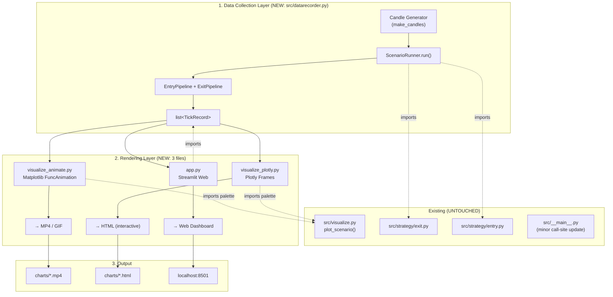

# ExitPipeline Dynamic Visualization — Architecture Design

> **Role**: Architect | **Target Audience**: Developer | **Date**: 2026-05-23
> **Principle**: Best visual effect with simplest implementation. Zero existing file modification.

---

## Table of Contents

1. [System Architecture](#1-system-architecture)
2. [File Structure](#2-file-structure)
3. [Data Collection Layer — ScenarioRunner](#3-data-collection-layer--scenariorunner)
4. [Rendering Layer API](#4-rendering-layer-api)
5. [Storyboard Scripts](#5-storyboard-scripts)
6. [Visual Design Specification](#6-visual-design-specification)
7. [Integration Points](#7-integration-points)
8. [Dependency & Setup](#8-dependency--setup)
9. [Implementation Sequence](#9-implementation-sequence)

---

## 1. System Architecture

### 1.1 Data Flow



### 1.2 Layered Architecture

```
┌─────────────────────────────────────────────────────────────┐
│                     __main__.py (caller)                     │
│  Calls ScenarioRunner → renders via visualize_*/app modules │
├─────────────────────────────────────────────────────────────┤
│              Data Collection Layer  (NEW)                    │
│  datarecorder.py: TickRecord + ScenarioRunner               │
├──────────────┬──────────────────┬───────────────────────────┤
│  animate.py  │  plotly.py       │  app.py                   │
│  (NEW)       │  (NEW)           │  (NEW)                    │
│  Matplotlib  │  Plotly Frames   │  Streamlit                │
│  FuncAnim    │  → self-contained│  → Web Dashboard          │
│  → MP4/GIF   │  HTML            │                           │
├──────────────┴──────────────────┴───────────────────────────┤
│              visualize.py (EXISTING, UNCHANGED)              │
│  Color palette constants: BLUE, ORANGE, GREEN, RED, GRAY    │
└─────────────────────────────────────────────────────────────┘
```

---

## 2. File Structure

```
src/
├── visualize.py            # UNCHANGED: static PNG generation
├── datarecorder.py         # NEW: TickRecord + ScenarioRunner
├── visualize_animate.py    # NEW: Matplotlib FuncAnimation → MP4/GIF
├── visualize_plotly.py     # NEW: Plotly Frames → interactive HTML
├── app.py                  # NEW: Streamlit web application
├── __main__.py             # MINIMAL CHANGE: import ScenarioRunner + new renderers
├── strategy/
│   ├── exit.py             # UNCHANGED
│   └── entry.py            # UNCHANGED
└── types.py                # UNCHANGED
```

**Zero existing file modification principle**: `visualize.py`, `exit.py`, `entry.py`, `types.py` are not touched. Only `__main__.py` gets a minor call-site addition (one extra `import` + one function call per render target).

---

## 3. Data Collection Layer — ScenarioRunner

### 3.1 `TickRecord` Dataclass

```python
# src/datarecorder.py

from dataclasses import dataclass, field

@dataclass
class TickRecord:
    """Complete state snapshot for a single K-line step.

    Captures everything needed to render one frame of animation.
    The renderer iterates TickRecord objects in order to build frames.
    """
    idx: int                  # 0-based step index relative to arm()
    kline_idx: int            # absolute candle index in the scenario
    price: float              # candle.close
    predicted: float          # cubic trajectory prediction at this timestamp
    residual_pct: float       # (price - predicted) / snapshot_price * 100
    confidence: float         # SIGMOID confidence [0, 1]
    decision: str             # "hold" | "take_profit" | "stop_loss" | "emergency_exit" | "timeout"

    # Metadata for display (not used in rendering math, but shown in hover/annotations)
    timestamp: float = 0.0
    snapshot_price: float = 0.0
    valley_price: float = 0.0
    gravity: float = 0.0
    exit_reason: str = ""
```

### 3.2 `ScenarioResult` Dataclass

```python
@dataclass
class ScenarioResult:
    """Complete result for one scenario run — ready for any renderer."""
    name: str                          # "1-Normal Take Profit"
    records: list[TickRecord]          # ordered list, records[0] is first tick after arm()

    # Static parameters (for rendering reference lines / annotations)
    snapshot_price: float
    valley_price: float
    no_recalc_threshold: float         # confidence stop threshold
    emergency_divergence: float        # ±emergency line in residual panel

    # Exit event
    exit_idx: int | None               # tick index where exit happened (None if no exit)
    exit_action: str                   # "hold" | "take_profit" | ...
```

### 3.3 `ScenarioRunner` Class

```python
class ScenarioRunner:
    """Orchestrates a full Entry → Arm → Tick loop → TickRecord[] pipeline.

    Extracts the data-collection logic currently embedded in __main__._run_scenario()
    into a reusable, testable component.

    Usage:
        runner = ScenarioRunner()
        result = runner.run("1_normal", make_candles_fn)
        # result.records is a list[TickRecord] ready for any renderer
    """

    def __init__(self, cfg_override: dict | None = None) -> None:
        """Initialize with optional config overrides (e.g., emergency_divergence)."""
        ...

    def run(self, name: str, make_candles: callable) -> ScenarioResult:
        """Run a single scenario end-to-end.
        
        Args:
            name: Human-readable scenario name
            make_candles: () -> list[Candle] factory function

        Returns:
            ScenarioResult with all TickRecord objects and metadata
        """
        ...

    def run_all(self) -> dict[str, ScenarioResult]:
        """Run all 4 scenarios. Returns {name: ScenarioResult}."""
        ...

    # ── Internal ──
    def _tick_loop(
        self, candles: list[Candle], entry_idx: int,
        exit_pipe: ExitPipeline, snapshot: Snapshot
    ) -> list[TickRecord]:
        """Walk candles[entry_idx+1:] through ExitPipeline.update(), 
        collect TickRecord for each step."""
        ...
```

### 3.4 Integration with `__main__.py`

The existing `__main__.py` has `_run_scenario()` which both runs the pipeline and collects data. The new `ScenarioRunner` replaces this internal logic:

```python
# __main__.py — only change: add imports and optional rendering calls

from src.datarecorder import ScenarioRunner

def main():
    ...
    runner = ScenarioRunner()
    s1 = runner.run("1-Normal Take Profit", demo_scenario_1_normal.candle_gen)
    s2 = runner.run("2-Divergence Stop Loss", demo_scenario_2_divergence.candle_gen)
    s3 = runner.run("3-Emergency Exit", demo_scenario_3_emergency.candle_gen)

    # --- static PNG (existing, unchanged) ---
    # plot_scenario(...) calls remain as-is

    # --- NEW: dynamic renderings ---
    from src.visualize_animate import create_animation
    from src.visualize_plotly import create_interactive

    for result in [s1, s2, s3]:
        create_animation(result)       # → charts/<name>.mp4
        create_interactive(result)     # → charts/<name>.html

    print("Streamlit: streamlit run src/app.py")
```

### 3.5 Scenario 4 Special Handling

Scenario 4 (Order State Machine) does not produce time-series data. It is a discrete state-transition narrative.

```python
@dataclass
class OrderStateRecord:
    """One step in an order's lifecycle."""
    step: int
    status: str          # "PENDING" | "SUBMITTED" | "PARTIALLY_FILLED" | ...
    description: str     # Human-readable event description
    highlight: bool      # True if this step should be visually emphasized

@dataclass
class OrderStateScenario:
    """Scenario 4: Order State Machine lifecycle demo."""
    name: str
    orders: list[list[OrderStateRecord]]  # One list per demo order
```

---

## 4. Rendering Layer API

### 4.1 `visualize_animate.py` — MP4/GIF Export

```python
"""Matplotlib FuncAnimation — offline video export.

Produces a self-contained MP4 (or GIF) showing K-line-by-K-line progression
across 3 synchronized panels with exit-pulse highlight.
"""

from pathlib import Path
from src.datarecorder import ScenarioResult

OUT_DIR = Path("charts")

# Reuse existing palette
from src.visualize import BLUE, ORANGE, GREEN, RED, GRAY

# ── Public API ──

def create_animation(
    result: ScenarioResult,
    output: str | None = None,
    fps: int = 5,
    dpi: int = 150,
    format: str = "mp4",         # "mp4" | "gif"
) -> Path:
    """Generate an MP4/GIF animation from scenario tick records.

    Args:
        result: ScenarioResult from ScenarioRunner.run()
        output: Output file path. Default: charts/<scenario_name>.mp4
        fps: Frames per second (default 5 → 200ms per K-line)
        dpi: Output resolution
        format: "mp4" (FFMpegWriter) or "gif" (PillowWriter)

    Returns:
        Path to the generated file.

    Example:
        runner = ScenarioRunner()
        result = runner.run("1-Normal", make_candles)
        path = create_animation(result, fps=5)
        # → charts/1-Normal_Take_Profit.mp4
    """
    ...


def create_all_animations(
    results: dict[str, ScenarioResult],
    fps: int = 5,
    format: str = "mp4",
) -> list[Path]:
    """Batch generate animations for all scenarios."""
    ...


# ── Internal ──

def _setup_figure(result: ScenarioResult) -> tuple[plt.Figure, tuple[plt.Axes, ...]]:
    """Create the 3-panel matplotlib figure with static elements (hlines, titles)."""
    ...

def _update_frame(
    frame: int,               # 0..N-1
    result: ScenarioResult,
    artists: dict,            # pre-created matplotlib artists
    fig: plt.Figure,
) -> list:
    """Update all artists for the given frame index. Called by FuncAnimation.

    Optimized with blit=True — only returns artists that actually change.
    """
    ...

def _draw_exit_pulse(
    ax: plt.Axes,
    x: float,
    y: float,
    frame: int,
    exit_frame: int,
    pulse_radius: float = 0.05,
) -> None:
    """Draw expanding/contracting red circle for exit highlight.

    Pulse sequence:
      frame == exit_frame     → pulse 1 (small, opaque)
      exit_frame+1            → pulse 2 (medium, 60% alpha)
      exit_frame+2            → pulse 3 (large, 30% alpha)
    """
    ...
```

**Implementation Notes for `_draw_exit_pulse`**:

The pulse effect is implemented as 3 consecutive frames with decreasing opacity and increasing radius:
- Frame `exit_frame`: draw circle at (x, y), radius=r, alpha=0.9
- Frame `exit_frame+1`: radius=2r, alpha=0.5
- Frame `exit_frame+2`: radius=3r, alpha=0.2
- Frame `exit_frame+3`: no circle (pulse complete)

On panels 2 (residual) and 3 (confidence), a semi-transparent red rectangle overlay is used instead of a circle, since the highlight applies to the bar/area at the exit index.

### 4.2 `visualize_plotly.py` — Interactive HTML

```python
"""Plotly Frame Animation — interactive HTML export.

Produces a self-contained HTML file with:
  - Play/Pause/Speed buttons
  - Time slider (drag to any K-line)
  - Hover tooltips showing exact values
  - Zoom/pan on all 3 panels
  - Exit pulse highlight (red circle marker appearing at exit frame)
"""

from pathlib import Path
from src.datarecorder import ScenarioResult, OrderStateScenario
from src.visualize import BLUE, ORANGE, GREEN, RED, GRAY

OUT_DIR = Path("charts")

# ── Public API ──

def create_interactive(
    result: ScenarioResult,
    output: str | None = None,
    frame_duration: int = 200,   # ms per frame
) -> Path:
    """Generate an interactive Plotly HTML animation.

    Args:
        result: ScenarioResult from ScenarioRunner.run()
        output: Output file path. Default: charts/<scenario_name>.html
        frame_duration: Milliseconds per animation frame (default 200ms)

    Returns:
        Path to the generated .html file.

    Example:
        path = create_interactive(result)
        # Open in browser: charts/1-Normal_Take_Profit.html
    """
    ...


def create_interactive_order_state(
    scenario: OrderStateScenario,
    output: str | None = None,
) -> Path:
    """Generate an interactive Plotly visualization for Scenario 4 (Order State Machine).

    Uses a Sankey diagram or a state-transition timeline with annotations.
    """
    ...


def create_compare_dashboard(
    results: dict[str, ScenarioResult],
    output: str | None = None,
) -> Path:
    """Generate a 4-scenario comparison dashboard as a single HTML.

    Uses Plotly subplots (2×2 grid), each panel plays independently or in sync.
    """
    ...


# ── Internal ──

def _build_frames(result: ScenarioResult) -> list[go.Frame]:
    """Build go.Frame list: one frame per TickRecord (cumulative data)."""
    ...

def _add_exit_highlight(
    fig: go.Figure,
    result: ScenarioResult,
    frame_idx: int,
) -> None:
    """Add red circle marker + annotation at the exit frame."""
    ...

def _build_layout(result: ScenarioResult) -> dict:
    """Build layout with play controls, slider, and 3-panel subplot config."""
    ...
```

**Plotly Color Mapping**:

```python
# Convert matplotlib hex colors to Plotly-compatible rgba
PLOTLY_COLORS = {
    "actual":    "rgba(37, 99, 235, 1.0)",    # BLUE
    "predicted": "rgba(249, 115, 22, 0.8)",    # ORANGE (dashed)
    "snapshot":  "rgba(107, 114, 128, 0.6)",   # GRAY
    "valley":    "rgba(22, 163, 74, 0.7)",     # GREEN
    "residual_pos": "rgba(220, 38, 38, 0.6)",  # RED (positive residual)
    "residual_neg": "rgba(22, 163, 74, 0.6)",  # GREEN (negative residual)
    "confidence": "rgba(22, 163, 74, 0.8)",    # GREEN
    "exit_marker": "rgba(220, 38, 38, 1.0)",   # RED
    "threshold": "rgba(220, 38, 38, 0.5)",     # RED (dashed)
}
```

### 4.3 `app.py` — Streamlit Web Application

```python
"""Streamlit web app for ExitPipeline visualization.

Launch: streamlit run src/app.py

Features:
  - Scenario selector (dropdown: 4 scenarios)
  - Auto-play with speed control
  - Manual K-line slider
  - Three-panel synchronized view (Plotly charts)
  - Exit event metrics panel (side column)
  - Download links for MP4/HTML exports
"""

import streamlit as st
from src.datarecorder import ScenarioRunner, ScenarioResult
from src.visualize_plotly import _build_frames, _build_layout
from src.visualize import BLUE, ORANGE, GREEN, RED, GRAY

# ── Page Config ──
st.set_page_config(
    page_title="ExitPipeline Visualizer",
    page_icon="📈",
    layout="wide",
)

# ── Session State ──
if "runner" not in st.session_state:
    st.session_state.runner = ScenarioRunner()
if "results" not in st.session_state:
    st.session_state.results = None
if "current_frame" not in st.session_state:
    st.session_state.current_frame = 0
if "playing" not in st.session_state:
    st.session_state.playing = False

# ── Sidebar ──
def render_sidebar() -> None:
    """Scenario selector, controls, and metrics."""
    ...

# ── Main Content ──
def render_main(result: ScenarioResult, frame: int) -> None:
    """Render 3-panel Plotly chart at the given frame index."""
    ...

# ── Entry Point ──
def main() -> None:
    st.title("Exit Pipeline — Dynamic Visualization")
    render_sidebar()
    # ... load data, render main, handle playback loop
```

**Streamlit Layout**:

```
┌──────────────────────────────────────────────────────────────────┐
│  Exit Pipeline — Dynamic Visualization                           │
├──────────────┬───────────────────────────────────────────────────┤
│ Sidebar      │ Main Content                                      │
│              │                                                    │
│ Scenario ▼   │ ┌───────────────────────────────────────────────┐ │
│ [1-Normal]   │ │ Panel 1: Price Trajectory                      │ │
│              │ │   (blue actual + orange predicted + markers)   │ │
│ Speed  ─●──  │ ├───────────────────────────────────────────────┤ │
│ [▶ Play]     │ │ Panel 2: Residual %                            │ │
│ [⏸ Pause]    │ │   (bar chart + emergency lines)               │ │
│ [⏮ Reset]    │ ├───────────────────────────────────────────────┤ │
│              │ │ Panel 3: Confidence                            │ │
│ K-line ──●── │ │   (SIGMOID curve + threshold)                 │ │
│  23 / 60     │ └───────────────────────────────────────────────┘ │
│              │                                                    │
│ Exit Info    │ [███████████████████░░░░░░░] 38% progress         │
│ ─────────    │                                                    │
│ Action: hold │                                                    │
│ Conf: 0.87   │                                                    │
│ Price: 96.3  │                                                    │
│ Resid: -1.2% │                                                    │
└──────────────┴───────────────────────────────────────────────────┘
```

---

## 5. Storyboard Scripts

### 5.1 Scenario 1: Normal Take Profit (Iron Rule II)

**Duration**: ~10 seconds | **Frames**: ~50 at 5fps | **Exit**: take_profit

| Time | Frame Range | Panel 1 (Price) | Panel 2 (Residual%) | Panel 3 (Confidence) | Audio/Notes |
|------|-------------|-----------------|---------------------|----------------------|-------------|
| 0.0-1.0s | 0-5 | **Title card fade-in**: "Scenario 1: Normal Take Profit" + parameter summary overlay (min_profit=0.2%, alpha=5.0, threshold=0.3). Background: white. | — | — | 静止标题卡，白色背景。标题+关键参数列表 |
| 1.0-2.0s | 5-10 | **Chart reveal**: All 3 panels appear. Snapshot horizontal line (gray dotted) at P₀=100. Valley target line (green dotted) at ~95. Price begins at 100. | Residual axis appears with ±5% emergency lines (red dashed). Bar at 0. | Confidence axis [0,1] with 0.3 threshold line (red dashed). Curve at 1.0. | 三面板同时淡入。水平参考线先出现，曲线紧随其后 |
| 2.0-5.0s | 10-25 | **K-line progression**: Blue actual-price line extends rightward, descending smoothly from 100 toward 96. Orange dashed cubic trajectory follows same path but slightly offset (prediction always slightly below actual during descent). | Green bars (negative residual) grow from 0 to ~-1.5%. Bar color: green fill, alpha=0.3. | Green confidence curve holds steady at ~0.9-0.95. Green area fill barely wavers. | 价格平稳下行，预测线紧随。残差柱负向小幅增长(绿色)。自信度高稳 |
| 5.0-7.0s | 25-35 | **Approaching valley**: Price decelerates near 95.50 (green valley line at 95.00). Actual curve bends toward valley. | Residual bars shrink back toward 0 as price approaches prediction. Color transitions from green to near-transparent. | Confidence rises from 0.92 → 0.98 as residual decreases. Green area expands slightly. | 价格曲线减速接近谷底线。残差收缩，自信度上升 |
| 7.0-8.0s | 35-40 | **Pre-exit tension**: Price at 95.03, just above valley (95.00). Actual line nearly touches green dotted line. | Residual near 0%. Bar nearly invisible. | Confidence at 0.99. Area fill nearly full. | 定价线逼近绿线，系统即将触发止盈 |
| 8.0-9.0s | 40-45 | **EXIT TRIGGER**: Price crosses valley (94.98 < 95.00). Dynamic gravity order filled. | — | — | 💥 关键瞬间 |
| 8.0-8.6s | 40-43 | **Pulse 1**: Red X marker appears at exit point on price curve. Red circle overlay (radius 0.3% of price range, alpha=0.9). Text annotation "TAKE PROFIT @ 94.98" appears. | Exit bar flashes bright red (alpha=1.0). | Confidence dot at exit index glows red. | 脉冲1: 小圆+高透明度 |
| 8.6-9.2s | 43-46 | **Pulse 2**: Red circle expands (radius 0.6%, alpha=0.5). Annotation persists. | Red bar fades to alpha=0.5. | Red dot fades. | 脉冲2: 中圆+半透明 |
| 9.2-9.8s | 46-49 | **Pulse 3**: Red circle expands further (radius 1.0%, alpha=0.2). | Red bar nearly transparent. | Dot barely visible. | 脉冲3: 大圆+低透明 |
| 9.8-10.0s | 49-50 | **Freeze frame**: Final state with all markers. Red X remains (non-pulsing). Price curve terminates at exit. Progress bar shows 100%. | Final residual bar with red X marker. | Final confidence with red X marker. | 定格画面，红X持久显示 |

**Color Legend for Scenario 1**:
- Blue solid: Actual price descending from 100 → 94.98
- Orange dashed: Cubic trajectory (matches closely, slight lead)
- Gray dotted: Snapshot price (100.00) — horizontal
- Green dotted: Valley target (95.00) — horizontal
- Red X + pulse: Exit at K-line ~48

---

### 5.2 Scenario 2: Divergence Stop Loss (Iron Rule III)

**Duration**: ~8 seconds | **Frames**: ~40 at 5fps | **Exit**: stop_loss

| Time | Frame Range | Panel 1 (Price) | Panel 2 (Residual%) | Panel 3 (Confidence) | Notes |
|------|-------------|-----------------|---------------------|----------------------|-------|
| 0.0-0.8s | 0-4 | **Title card**: "Scenario 2: Divergence Stop Loss". Parameters: no_recalc=0.3, emergency=5%. | — | — | 标题卡 |
| 0.8-2.0s | 4-10 | **Charts appear**: Price starts at ~100.00, begins mild descent along prediction. Snapshot=100, Valley=~98. | Residual bars near 0, small green fluctuations (±0.5%). | Confidence stable at ~0.85-0.90. Green area. | 初始平稳，价格在预测线附近 |
| 2.0-3.5s | 10-18 | **Divergence begins**: Price stops descending and starts rising sharply (against downtrend prediction). Blue actual line bends upward while orange predicted continues downward. Gap opens visibly. | Residual bars turn from green (negative) → near-zero → red (positive). Bars grow upward, reaching +2% (red fill, alpha increasing with magnitude). | Confidence begins dropping: 0.88 → 0.65 → 0.50. Green area shrinks. | 分歧出现：价格反转上行，预测继续下行 |
| 3.5-5.0s | 18-25 | **Accelerating divergence**: Price rises +4% from trough. Actual line clearly above predicted line. Gap = 2+ price units. | Residual bars grow from +2% → +4% → +5%. Bright red fill (alpha=0.6). Emergency line at ±5% visible. | Confidence plummets: 0.50 → 0.35 → 0.28. Green area collapsing. Red zone (below 0.3) intensifies. | 分歧加剧：残差柱冲高，自信度暴跌 |
| 5.0-5.8s | 25-29 | **Threshold crossing**: Confidence crosses below 0.3. Red zone in confidence panel glows. | Residual at +5.5%. Emergency line highlighted (red dashed line pulsing). | Confidence at 0.27, below threshold. Red fill in threshold zone. | 自信心跌破0.3阈值 |
| 5.8-6.8s | 29-34 | **EXIT: STOP_LOSS**. Red pulse on all 3 panels. Annotation "STOP LOSS — Confidence 0.27 < 0.3". | Residual bar at +5.5% flashes bright red. | Confidence curve below threshold, entire panel tinted red (alpha=0.1 overlay). | 💥 三面板同时红闪 |
| 6.8-8.0s | 34-40 | **Freeze frame**. All final state markers visible. "STOP LOSS" label persists. | — | — | 定格 |

**Key Visual Difference from Scenario 1**:
- Residual bars start green (negative) → transition to red (positive) ← **color shift is the story**
- Confidence curve drops dramatically (0.9 → 0.27) ← **downward slope tells the story**
- The threshold crossing at 0.3 is the climax, not the valley price crossing

---

### 5.3 Scenario 3: Emergency Exit / "拔网线" (Iron Rule V)

**Duration**: ~6 seconds | **Frames**: ~30 at 5fps | **Exit**: emergency_exit

| Time | Frame Range | Panel 1 (Price) | Panel 2 (Residual%) | Panel 3 (Confidence) | Notes |
|------|-------------|-----------------|---------------------|----------------------|-------|
| 0.0-0.6s | 0-3 | **Title card**: "Scenario 3: Emergency Exit (Iron Rule V)". "拔网线" subtitle. emergency_divergence=5%. | — | — | 标题卡 |
| 0.6-2.0s | 3-10 | **Calm before storm**: Price at ~100, small oscillations. Blue line nearly overlaps orange prediction. | Residual bars tiny (±0.3%), alternating green/red. | Confidence high at ~0.92. Calm green area. | 风平浪静 |
| 2.0-3.0s | 10-15 | **K-line 35: SUDDEN SPIKE**. Price jumps from ~99.5 to ~108.0 in ONE frame. Blue line shoots vertically. Prediction (orange) stays at ~99.5 — oblivious to the spike. | Residual bar **explodes**: from near 0 → +8.5%. Bar shoots past the +5% emergency line. Emergency line flashes bright red. Y-axis auto-scales to accommodate. | Confidence: SIGMOID receives massive residual input. Confidence drops from 0.92 → **0.02** in one frame (nearly vertical drop). Area fill vanishes. | ⚡ 瞬间爆发 |
| 3.0-3.3s | 15-17 | **Emergency detection**: Residual at +8.5% >> +5.0% threshold. Entire Panel 2 gets red-tinted overlay (alpha=0.15). Text annotation "EMERGENCY: +8.5% > 5%" appears. | — | — | 残差超标检测 |
| 3.3-4.5s | 17-23 | **EXIT: EMERGENCY_EXIT**. Three-panel simultaneous red flash. Panel 1: Red X at spike price (108.0) + "拔网线" annotation. Panel 2: Residual bar bright red + emergency line bold red. Panel 3: Confidence near 0, red threshold zone fills entire panel. | — | — | 🔴 拔网线！ |
| 4.5-6.0s | 23-30 | **Freeze frame with context**: Price spike visible, prediction line continues its oblivious descent (showing why emergency was necessary). "EMERGENCY EXIT — Iron Rule V" title. | — | — | 定格，展示预测与实际的天壤之别 |

**Special Visual Effects for Scenario 3**:
- The price spike K-line (frame 15-16): use a **vertical red arrow** pointing up, or **red candlestick-style bar**
- Residual panel Y-axis: momentarily auto-expands to accommodate the +8.5% bar — then returns to normal range
- Confidence drop: the curve line turns from green → yellow → red as confidence crosses 0.5 → 0.3 → 0.05
- "拔网线" (pull the plug): Chinese text annotation with electric-plug icon (if available) or ⚡ unicode

---

### 5.4 Scenario 4: Order State Machine Lifecycle

**Duration**: ~8 seconds | **Not K-line based** | **Format**: Animated state diagram

**Visual Approach**: Instead of 3-panel time series, use a single-pane animated **state transition diagram** + **event log table**.

| Time | Visual | Description |
|------|--------|-------------|
| 0.0-1.0s | **Title**: "Order State Machine — Lifecycle Demo". Subtitle: "Iron Rule VI: Network resilience". State diagram skeleton appears: 6 nodes (PENDING → SUBMITTED → PARTIALLY_FILLED → FILLED, plus REJECTED, CANCELLED, EXPIRED as side branches). | 标题 + 状态机骨架 |
| 1.0-2.5s | **Order 1: Happy Path (BTC/USDT)**. Node SUBMITTED lights up (blue) → PARTIALLY_FILLED (orange, 50% filled shown) → FILLED (green, 100%). Connector arrows between these nodes animate (draw from left to right). Event log table grows: row by row. | 订单1: 正常成交 |
| 2.5-4.0s | **Order 2: Reject + Retry (ETH/USDT)**. SUBMITTED → REJECTED ("rate limit", red node). Arrow back to SUBMITTED (retry label "1/3"). SUBMITTED → REJECTED ("insufficient margin", red). Arrow back ("2/3"). SUBMITTED → REJECTED ("rate limit", red). Retry exhausted. Node remains REJECTED (dark red). | 订单2: 三次拒绝 |
| 4.0-5.0s | **Order 3: Manual Cancel (SOL/USDT)**. SUBMITTED (blue) → CANCELLED (gray). Arrow drawn from SUBMITTED to CANCELLED directly. "User cancelled" annotation. | 订单3: 手动取消 |
| 5.0-6.0s | **Order 4: Timeout (DOGE/USDT)**. SUBMITTED (blue) → TIMEOUT icon appears → EXPIRED (orange). Clock icon animation next to TIMEOUT node. "5.0s elapsed > 5.0s limit" annotation. | 订单4: 超时过期 |
| 6.0-8.0s | **Summary Table**: All 4 orders shown with their terminal states. 1 green (filled), 2 red (rejected), 1 gray (cancelled), 1 orange (expired). Legend at bottom. | 汇总表 |

**Plotly Implementation**: Use a **Sankey diagram** for the state transitions, with animated node colors. Or use **annotated scatter** with animated arrows (go.Scatter + go.layout.shapes for connectors).

**Alternative (simpler) Implementation**: Timed text log with color-coded status badges, rendered as a Plotly table or rich-text annotations that appear sequentially.

---

## 6. Visual Design Specification

### 6.1 Color Palette (from existing `visualize.py`)

```python
BLUE    = "#2563eb"   # Actual price line, normal state
ORANGE  = "#f97316"   # Predicted line (dashed), residual baseline
GREEN   = "#16a34a"   # Valley target, confidence above threshold
RED     = "#dc2626"   # Exit marker, emergency, threshold violation
GRAY    = "#6b7280"   # Reference lines (snapshot price, zero residual)
```

### 6.2 Exit Highlight — Pulse Specification

```
Pulse Sequence (3 beats, 200ms apart at 5fps = 1 frame apart):

Frame 0 (exit_frame):
  - Panel 1: Red circle, radius=0.3% of y_range, alpha=0.9, at (exit_idx, exit_price)
  - Panel 2: Residual bar at exit_idx colored solid RED (alpha=1.0)
  - Panel 3: Confidence dot at exit_idx colored RED, size=12

Frame 1 (exit_frame + 1):
  - Panel 1: Red circle, radius=0.6% of y_range, alpha=0.5
  - Panel 2: Residual bar at exit_idx colored RED (alpha=0.6)
  - Panel 3: Confidence dot RED, size=10

Frame 2 (exit_frame + 2):
  - Panel 1: Red circle, radius=1.0% of y_range, alpha=0.2
  - Panel 2: Residual bar alpha=0.3
  - Panel 3: Confidence dot RED, size=8

Frame 3+ (exit_frame + 3 onward):
  - Panel 1: Red X marker persists (scatter, size=100, alpha=1.0), no pulse circle
  - Panel 2: Red X marker at exit bar persists
  - Panel 3: Red X marker at exit confidence persists
```

### 6.3 Residual Bar Color Mapping

```python
def residual_bar_color(residual_pct: float, emergency: float) -> tuple[str, float]:
    """Map residual to bar color and alpha.

    - Negative (price < predicted): GREEN, alpha proportional to |residual|/emergency
    - Positive (price > predicted): RED, alpha proportional to |residual|/emergency
    - Near emergency line: alpha ramps up to 0.8
    - Beyond emergency: alpha = 1.0
    """
    magnitude = abs(residual_pct)
    if residual_pct < 0:
        color = GREEN
    else:
        color = RED

    # Alpha: 0.15 base + 0.85 scaled to emergency threshold
    alpha = 0.15 + 0.85 * min(magnitude / emergency, 1.0)
    return color, alpha
```

### 6.4 Confidence Area Fill

```python
# Above threshold (confidence >= no_recalc_threshold): GREEN fill, alpha=0.1 + 0.2*(conf - threshold)
# Below threshold (confidence < no_recalc_threshold): RED fill, alpha=0.3 + 0.5*(threshold - conf)/threshold
# The RED zone below threshold is always visible (alpha >= 0.08), but intensifies as confidence drops
```

### 6.5 Progress Bar

Positioned at the bottom of the figure (shared across all panels):

```
[████████████████████░░░░░░░░░░░░░]  K-line 34/60  (56.7%)
```

Matplotlib implementation: `fig.text()` or a dedicated bottom axes.
Plotly implementation: `layout.annotations` with dynamically updated text.
Streamlit implementation: `st.progress(frame / total_frames)` in sidebar.

### 6.6 Typography & Layout

```python
# Matplotlib
plt.rcParams["font.size"] = 10
plt.rcParams["axes.titlesize"] = 12
plt.rcParams["axes.labelsize"] = 9
plt.rcParams["legend.fontsize"] = 8

# Figure dimensions
figsize=(12, 9)           # 4:3 aspect for 3-panel layout
dpi=150                   # Output resolution

# Panel height ratios
gridspec_kw={"height_ratios": [3, 1.5, 1.5]}  # Price panel is tallest

# Consistent margins
plt.subplots_adjust(left=0.08, right=0.95, top=0.93, bottom=0.08, hspace=0.15)
```

For Plotly:
```python
fig.update_layout(
    height=900,
    margin=dict(l=60, r=40, t=60, b=60),
    font=dict(family="PingFang SC, Arial, sans-serif", size=12),
    hovermode="x unified",  # Show all values at hovered x-position
)
```

---

## 7. Integration Points

### 7.1 Where New Code Connects to Existing Code

```
Existing Code                     New Code                       Connection Type
─────────────                     ────────                       ───────────────
src/visualize.py                  visualize_animate.py           import BLUE,ORANGE,...
  (color palette)                  visualize_plotly.py

src/strategy/exit.py              datarecorder.py                import ExitPipeline,
  (ExitPipeline, OrderSM)                                          OrderStateMachine

src/strategy/entry.py             datarecorder.py                import EntryPipeline
  (EntryPipeline)

src/types.py                      datarecorder.py                import Candle, Snapshot,
  (Candle, Snapshot, etc.)                                         ExitDecision

src/__main__.py                   datarecorder.py                import ScenarioRunner
  (demo scenarios)                 visualize_animate.py           import create_animation
                                   visualize_plotly.py            import create_interactive
```

### 7.2 Minimal `__main__.py` Changes

Current `__main__.py` calls:

```python
# Existing (keep as-is for static PNG)
path = plot_scenario(...)
```

Add after existing chart generation block:

```python
# ── NEW: Dynamic visualization exports ──

# Option 1: Generate MP4 animations
from src.datarecorder import ScenarioRunner
from src.visualize_animate import create_all_animations

runner = ScenarioRunner()
results = {
    "1-Normal Take Profit": runner.run("1-Normal Take Profit", demo_scenario_1_normal.candle_gen),
    "2-Divergence Stop Loss": runner.run("2-Divergence Stop Loss", demo_scenario_2_divergence.candle_gen),
    "3-Emergency Exit": runner.run("3-Emergency Exit", demo_scenario_3_emergency.candle_gen),
}
mp4_paths = create_all_animations(results)
for p in mp4_paths:
    print(f"  ✓ MP4: {p}")

# Option 2: Generate interactive HTML
from src.visualize_plotly import create_interactive

for name, result in results.items():
    html_path = create_interactive(result)
    print(f"  ✓ HTML: {html_path}")

# Option 3: Launch Streamlit (manual)
print("\n  Streamlit: streamlit run src/app.py")
```

The change is **additive only**: existing `plot_scenario()` and `plot_summary_dashboard()` calls remain untouched.

### 7.3 Data Transformation Bridge

To avoid duplicating the data-collection logic in both `__main__` and `ScenarioRunner`, the `ScenarioRunner.run()` method internally replicates the existing `_run_scenario()` logic from `__main__.py`. The key difference: instead of returning a flat dict, it returns a typed `ScenarioResult` with `TickRecord` objects.

For backward compatibility, a `ScenarioResult.to_legacy_dict()` method can be provided:

```python
class ScenarioResult:
    def to_legacy_dict(self) -> dict:
        """Convert to the dict format expected by existing plot_scenario()."""
        return {
            "name": self.name,
            "times": [r.idx for r in self.records],
            "actuals": [r.price for r in self.records],
            "predicted": [r.predicted for r in self.records],
            "snapshot_price": self.snapshot_price,
            "valley_price": self.valley_price,
            "residuals": [r.residual_pct for r in self.records],
            "confidences": [r.confidence for r in self.records],
            "exit_idx": self.exit_idx,
            "exit_action": self.exit_action,
            "no_recalc_threshold": self.no_recalc_threshold,
            "emergency_divergence": self.emergency_divergence,
        }
```

---

## 8. Dependency & Setup

### 8.1 Required Packages

```bash
# Already installed (verified by python-visualization-libs.md survey)
pip install matplotlib plotly streamlit

# For MP4 export with matplotlib (likely already installed)
pip install ffmpeg          # or: brew install ffmpeg (macOS)
```

### 8.2 Verification Commands

```bash
# Verify imports work
python -c "from matplotlib.animation import FuncAnimation, FFMpegWriter; print('OK: matplotlib')"
python -c "import plotly.graph_objects as go; from plotly.subplots import make_subplots; print('OK: plotly')"
python -c "import streamlit; print('OK: streamlit')"

# Run the demo
python -m src                            # Existing static PNG demo
python src/visualize_animate.py          # Generate MP4s (standalone test)
python src/visualize_plotly.py           # Generate HTMLs (standalone test)
streamlit run src/app.py                 # Launch web app
```

### 8.3 Output Directory

All output files go to the existing `charts/` directory (already created by `visualize.py`):

```
charts/
├── 1-Normal_Take_Profit.png       # existing static
├── 1-Normal_Take_Profit.mp4       # NEW
├── 1-Normal_Take_Profit.html      # NEW
├── 2-Divergence_Stop_Loss.png
├── 2-Divergence_Stop_Loss.mp4
├── 2-Divergence_Stop_Loss.html
├── 3-Emergency_Exit.png
├── 3-Emergency_Exit.mp4
├── 3-Emergency_Exit.html
├── 4-Order_State_Machine.html     # NEW (no time-series, HTML only)
├── dashboard.png                  # existing
└── compare_dashboard.html         # NEW (optional: 4-scenario comparison)
```

---

## 9. Implementation Sequence

Recommended build order (each step is independently testable):

| Phase | File | Effort | Deliverable | Verification |
|-------|------|--------|-------------|-------------|
| 1 | `datarecorder.py` | 0.5 day | `ScenarioRunner` + `TickRecord` working, produces correct data for all 3 scenarios | `assert len(result.records) > 0` and compare output to existing `__main__` prints |
| 2 | `visualize_animate.py` | 1 day | MP4 with K-line progression, 3 panels, exit pulse effect | Open MP4, verify animation plays with correct exit highlight |
| 3 | `visualize_plotly.py` | 1 day | Interactive HTML with Play/Pause, slider, hover tooltips | Open HTML in browser, drag slider, verify hover values |
| 4 | `app.py` | 0.5 day | Streamlit web app with scenario selector, auto-play, metrics sidebar | `streamlit run`, test all 4 scenarios |
| 5 | `__main__.py` integration | 0.25 day | Add import + call to new renderers, does not break existing output | `python -m src` produces both old PNGs and new MP4/HTML |
| 6 | Polish & edge cases | 0.25 day | Scenario 4 visualization (order state machine), edge-case handling (no-exit scenarios, empty records) | Manual review of all outputs |

**Total estimated effort**: ~3.5 days for a single developer.

### Phase Dependencies

```
Phase 1 (datarecorder) ──┬──→ Phase 2 (animate.py)
                         ├──→ Phase 3 (plotly.py)
                         └──→ Phase 4 (app.py)
                                       │
Phases 2,3,4 can run in parallel ─────┘
                                       │
                                       v
                                  Phase 5 (__main__ integration)
                                       │
                                       v
                                  Phase 6 (polish)
```

---

## Appendix A: Comparison with Existing Approaches

| Aspect | Current (Static PNG) | New (Dynamic) |
|--------|---------------------|---------------|
| Output format | `.png` | `.mp4` + `.html` + Web |
| Time dimension | All data at once | K-line by K-line progression |
| Exit highlight | Single red X | 3-pulse red circle + annotation |
| Interactivity | None | Zoom, pan, hover, slider, play/pause |
| Multi-scenario | 2×2 static grid | Synced playback or individual |
| Shareability | Image file | Self-contained HTML / MP4 video |
| Code changes | N/A | 0 existing files modified |

---

## Appendix B: Edge Cases & Error Handling

| Case | Handling |
|------|----------|
| No exit triggered (all K-lines consumed) | `exit_idx = None`, renderer shows full sequence without exit highlight, subtitle "(untriggered)" |
| Only 1 tick record | Animation renders as still frame (single data point), no crash |
| Empty records list | `ScenarioResult.records = []`, renderer returns early with a placeholder message |
| Missing ffmpeg (MP4 export) | `create_animation()` catches `FileNotFoundError`, prints "Install ffmpeg: brew install ffmpeg", falls back to GIF |
| Very long scenario (>200 ticks) | FPS automatically adjusted: `fps = max(2, min(10, 1000 / len(records)))` to keep animation under 60 seconds |
| Chinese characters in titles | `plt.rcParams["font.sans-serif"]` already configured (PingFang SC), Plotly uses system fonts |
